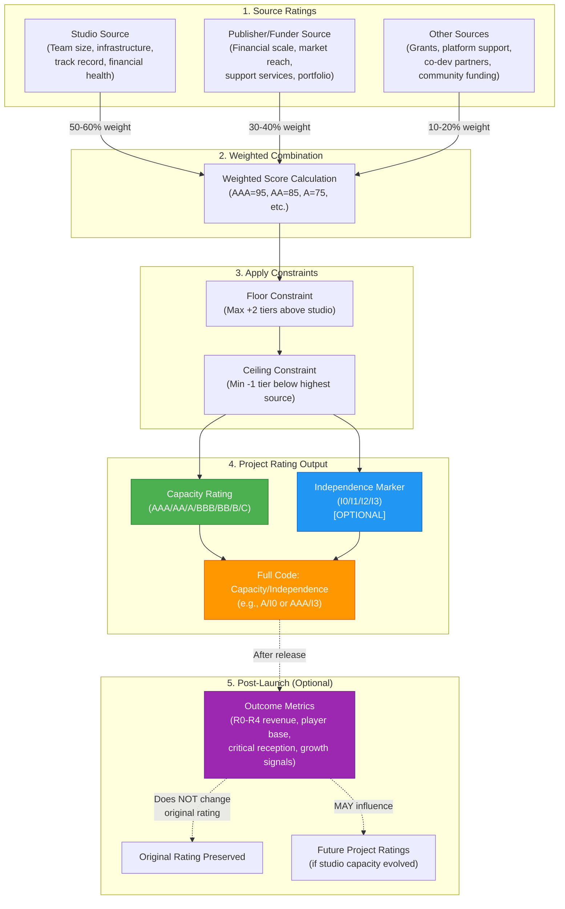

# Game Project Classification Standard (GPCS)
## A Bond-Style Rating System for Game Projects

**Version:** 0.5.0
**Author:** Devon Stanton
**Date:** December 2025
**License:** CC BY 4.0

---

## Executive Summary

The video game industry relies on informal labels (Indie, AA, AAA) to describe projects and their development contexts. These terms are culturally defined rather than structurally defined, leading to inconsistency, unfair competition, and a lack of transparency.

The **Game Project Classification Standard (GPCS)** proposes a formal, bond-style rating system that rates **projects**, not studios.

**Terminology:** This whitepaper defines the **Game Project Classification Standard (GPCS)**. In shorthand, the resulting per-project label is referred to as a **GPC rating** (e.g., `A/I1 — Verified — v0.5`). Drawing inspiration from financial credit ratings, GPCS uses the familiar AAA/AA/A/BBB/BB/B/C scale to indicate production capacity and resource backing. The framework evaluates contributing **sources** independently (studios, publishers, funders) and combines them into a composite project rating.

Rather than a single fuzzy label, projects are rated through:

1. **Source Ratings**: Studios, publishers, and funders are each rated based on their capacity, resources, and track record
2. **Project Rating Combination**: Source ratings are combined using a transparent methodology to produce a project rating
3. **Outcome Tracking**: Post-release performance enables reclassification and lifecycle tracking

The framework is:

- **Voluntary**: projects self-classify through source disclosure
- **Transparent**: all criteria and combination methodology are public
- **Non-invasive**: no sensitive financial disclosure required
- **Project-centric**: same studio can have multiple projects with different ratings simultaneously

This white paper outlines the problem, presents the framework, and invites adoption by platforms, awards bodies, publishers, and the broader industry.

---

## Implementation Brief (For Decision-Makers)

**For platform operators, awards bodies, grant programmes, and publishers evaluating GPCS adoption.**

### What GPCS Is

A voluntary, transparent rating system that classifies **game projects** (not studios) based on production capacity and resource backing. Projects receive a dual-code rating indicating:
- **Capacity** (AAA/AA/A/BBB/BB/B/C): Production scale and infrastructure
- **Independence** (I0/I1/I2/I3 - optional): Ownership and creative control structure

### What It Outputs

**Example GPC Rating:** `A/I1 — Verified — v0.5`

- **A**: Mid-tier production capacity (30-80 person studio, established backing)
- **I1**: Partial independence (publisher-backed, studio retains IP)
- **Verified**: Public evidence validated (LinkedIn, press releases, company registry)
- **v0.5**: Framework version used for rating

**Certificate Breakdown:**
- Studio Source Rating: A (35-person team, 2 shipped titles, stable funding)
- Publisher Source Rating: AA (Devolver Digital - $5M-$30M budget range)
- Other Sources: Platform grant (BBB - ID@Xbox dev kit + marketing support)
- Project Rating: A (weighted combination: 77.5 score)
- Independence: I1 (studio retains IP, publisher has distribution rights)

### What Data Is Required

**10-minute self-rating form** with 12 questions using bracketed ranges (no exact figures required):
- Studio: Team size band, infrastructure level, track record, financial health, geographic footprint
- Publisher: Financial scale band, market reach, support services, platform relationships
- Other Sources: Grants, platform support, co-development, community funding

**No sensitive financial disclosure required.** All inputs use safe ranges (e.g., "$1M-$5M" not "$2.3M").

### How Verification Works

**Three tiers:**
- **Unverified:** Self-reported, no evidence (displayed with flag)
- **Verified:** Public evidence validated (LinkedIn, press releases, company registry, credited titles)
- **Audited:** Third-party auditor reviews confidential materials (financials disclosed to auditor, NOT published)

Awards bodies can require Verified+; grants can require Audited. Appropriate verification level depends on use case stakes.

### Three Adoption Asks

**1. Awards Bodies:** Use GPCS capacity tiers for fair competition categories while keeping public-facing names intuitive, with the tier criteria shown as a subtitle or judging note:
- **Best Solo Project** — Eligible projects classified as C/B under GPCS (solo creators and very small teams)
- **Best Emerging Studio** — Projects classified as BB/BBB under GPCS (growing studios with expanding support)
- **Best Mid-Tier Production** — Projects classified as A under GPCS (fully staffed mid-size productions)
- **Best Flagship Production** — Projects classified as AA/AAA under GPCS (large-scale productions with enterprise backing)

**2. Grant Programmes:** Use GPCS source ratings for eligibility criteria
- "Eligible: C/B/BB-rated studios only" (emerging creators)
- "Ineligible: Projects with A-rated or higher publisher backing" (ensure grants reach those who need them)
- Verifiable structural criteria replace lengthy financial disclosure

**3. Platforms:** Integrate GPC ratings into discovery and developer programmes
- Curated collections ("Exceptional C-rated projects", "Best AA releases this month")
- Discovery algorithms (surface projects within peer capacity groups)
- Differentiated developer support based on project rating

### Why This Works

- **Voluntary:** No project is rated without consent
- **Transparent:** All criteria and methodology are public
- **Non-invasive:** No confidential financial disclosure required
- **Prospective:** Projects can be rated before release (concept, production, or post-launch)
- **Lifecycle-aware:** Projects can be re-rated at milestones, tracking growth over time

### Questions?

See full whitepaper for detailed methodology, governance, use cases, and references.

---

## ⚠️ What GPC Ratings Are NOT
**For skim readers:** GPC ratings describe production capacity and resource backing. They do NOT measure:

1. **Quality or artistic merit** — A C-rated project can win Game of the Year awards
2. **Commercial potential or guaranteed success** — An AAA-rated project can be a commercial failure
3. **Genre scope or ambition** — A narrative walking simulator and an open-world RPG can share a rating if resource backing is equivalent
4. **Development duration or timeline** — Ratings reflect capacity, not how long a project takes
5. **Cultural or aesthetic "indie" identity** — A project can be A-rated and culturally "indie," or C-rated and aesthetically commercial

**Examples:**
- **Stardew Valley** (solo developer, self-published, minimal budget) would be rated C, yet it sold millions and won critical acclaim
- **Anthem** (BioWare, EA, massive budget) would be rated AAA, yet it underperformed commercially and critically

GPCS provides **context**, not **judgement**. A C-rated masterpiece is still a masterpiece. A AAA-rated failure is still a failure. The rating helps stakeholders understand the production scale and resource environment, not the outcome.

---

## Table of Contents

1. [Introduction](#1-introduction)
2. [The Problem](#2-the-problem)
3. [Why Current Labels Fail](#3-why-current-labels-fail)
4. [The Framework](#4-the-framework)
5. [Classification Dimensions](#5-classification-dimensions)
6. [Tier Definitions](#6-tier-definitions)
7. [How Classification Works](#7-how-classification-works)
8. [Use Cases](#8-use-cases)
9. [Supporting Research & Comparative Analysis](#9-supporting-research--comparative-analysis)
10. [Design Principles](#10-design-principles)
11. [Governance & Evolution](#11-governance--evolution)
12. [Call to Adoption](#12-call-to-adoption)
L. [Appendix A: GPC-ID Format and Lookup Rules](#appendix-a-gpc-id-format-and-lookup-rules)

---

## 1. Introduction

The video game industry has grown from a niche hobby into a global entertainment sector generating over $180 billion annually [Newzoo Global Games Marketing Report 2025](https://newzoo.com/resources/trend-reports/newzoo-global-games-market-report-2025). Yet despite this maturation, the industry lacks fundamental infrastructure that other creative sectors take for granted: a standardised way to classify and compare projects based on their production contexts.

Film has its budget tiers and production categories. Music has major labels, independent labels, and self-released artists with clear distinctions. Publishing distinguishes between the Big Five, mid-size houses, and small presses. The game industry, by contrast, relies on vague, culturally-defined terms that emerged organically and have never been formalised.

The terms "Indie," "AA," and "AAA" originated in the early 1990s as the industry began distinguishing between different scales of production. Initially useful shorthand, these labels have become increasingly inadequate as the industry has diversified. A solo developer working from their bedroom, a 30-person studio with venture capital backing, and a 15-person team bootstrapping their first commercial release might all describe themselves as "indie," despite having fundamentally different resources, constraints, and contexts.

This terminology gap creates practical problems across the industry: unfair competition in awards, unclear eligibility for grants, inconsistent media coverage, and difficulty for studios to position themselves accurately. The Game Project Classification Standard (GPCS) addresses this gap by proposing a formal, multi-dimensional taxonomy built on verifiable structural criteria rather than subjective cultural labels.

---

## 2. The Problem

The game industry has no standard system for classifying projects by production scale and resource backing. The labels we use, Indie, AA, and AAA, emerged informally and mean different things to different people.

This absence of structure creates real problems:

- **Studios** cannot position themselves accurately or benchmark against true peers
- **Awards and showcases** pit mismatched studios against each other
- **Publishers and investors** lack meaningful segmentation for scouting
- **Grant programmes** struggle to define clear eligibility criteria
- **Press and analysts** report on segments inconsistently
- **Players** have no reliable way to understand a game's production context

The industry deserves better.

---

## 3. Why Current Labels Fail

### 3.1 Definitions Are Inconsistent

There is no universal agreement on what Indie, AA, or AAA mean. Different sources cite different thresholds (Humble Games, 2022; Pearce, cited in Wikipedia):

- "Indie" might mean budget under $1M, team under 10, or simply "no publisher"
- "AA" ranges from "a few million" to "tens of millions" depending on who you ask
- "AAA" is vaguely "big budget, big team, big publisher" without clear boundaries

The same studio could be classified differently depending on which criteria you prioritise.

### 3.2 Labels Conflate Multiple Dimensions

Current classifications muddle together distinct variables:

| Dimension | What It Measures |
|-----------|------------------|
| Budget | How much money is spent |
| Team size | Number of developers |
| Funding source | Self-funded vs publisher-backed |
| Creative independence | Who controls creative decisions |
| Production values | Visual fidelity, scope, polish |
| Distribution | Digital-only vs retail presence |

A single label cannot meaningfully capture all of these. A 40-person studio with publisher funding is fundamentally different from a solo developer, yet both might call themselves "indie."

### 3.3 Wildly Different Studios Get Lumped Together

The current system creates absurd groupings:

- A one-person hobbyist and a 40-person funded studio both labelled "indie"
- A $5M project and a $25M project both called "AA"
- Studios with radically different resources competing in the same category

### 3.4 Unfair Competition

Without clear classification:

- Awards pit mismatched studios against each other
- "Best Indie Game" becomes meaningless when entries range from solo projects to 50-person teams (Conditt, 2023; Wilde, 2023)
- Well-funded studios labelled "indie" crowd out genuine small creators
- Backlash against "fake indies" creates identity friction—as when Dave the Diver's own director stated "there's nothing indie about it" despite its nomination (Hwang, cited in VGC, 2023)

**Case Study: The Game Awards 2025 – Megabonk**

A nominated title was withdrawn from the "Best Debut Indie Game" category in November 2025 when the developer (Vedinad) clarified they had previously shipped games under other studio names. The developer stated: "It's an honour, but I don't think it qualifies for debut indie game... I've made games in the past under different studio names, so Megabonk is not my debut game" (Kotaku, 2025). The Game Awards producer Geoff Keighley confirmed the removal, marking the first voluntary withdrawal in the ceremony's history.

This incident highlights how even high-profile awards lack consistent, verifiable definitions for terms like "debut" and, more broadly, "indie." The eligibility determination fell to the creator's integrity rather than transparent structural criteria, forcing retroactive corrections after public nominations were announced. GPCS-style structural classification combined with a simple "debut" eligibility flag (first commercial release from this legal entity/studio name) would prevent category mismatches before nominations, eliminating both the burden on creators and the credibility damage to awards bodies.

### 3.5 No Lifecycle Tracking

Current labels are static. There is no mechanism to:

- Track how studios grow over time
- Recognise when a studio graduates from one tier to another
- Benchmark success relative to starting context
- Celebrate growth without losing credibility

---

## 4. The Framework

The GPCS addresses these failures through a **source-based project rating system**.

### 4.1 Projects Are Rated, Not Studios

Unlike traditional approaches that classify studios as "indie" or "AAA," GPCS rates **individual projects**. This reflects the reality that studios commit different resources to different projects, and the same studio may simultaneously have projects operating at different scales with different goals.

**Studios do not have a single GPC rating; projects do. Studios are evaluated as sources that contribute to project ratings, but they themselves are not classified or ranked in aggregate.**

A studio does not have a single fixed classification. Instead, each project receives a rating based on the sources contributing to it: the studio's capacity, publisher support, funding backing, and other material contributions.

### 4.2 Capacity Rating Scale (Bond-Style Nomenclature)

GPCS adopts the bond rating nomenclature familiar from financial markets: **AAA, AA, A, BBB, BB, B, and C** (with modifiers + and - where applicable).

**The public-facing scale is:** AAA, AA, A, BBB, BB, B, C (with + and - modifiers where applicable). This provides a simplified 7-tier structure that maintains clarity and avoids over-segmentation at lower tiers, where distinctions are less meaningful for industry use cases.

**Why borrow from financial ratings?**

In financial markets, bond ratings indicate creditworthiness and default risk. Standard & Poor's, Moody's, and Fitch use these scales to communicate the quality and risk profile of debt instruments. AAA represents the highest quality and lowest risk; ratings decline through investment grade (BBB and above) into speculative grade (BB and below).

For game projects, GPCS borrows **only the scale**, not the underlying concept of financial risk. The ratings indicate **production capacity and resource backing**, not creditworthiness, commercial viability, or default probability.

**Rationale for simplified lower tiers:** Financial rating systems extend to CCC, CC, and C for granular distinctions in distressed debt scenarios. GPCS uses a single C tier for solo developers and micro-teams because further sub-segmentation provides little practical value in game industry contexts. The difference between a solo developer and a 2-person partnership is less relevant to awards categories, grant eligibility, or platform curation than the difference between C-tier and B-tier projects.

**Key distinctions:**

| Bond Ratings (S&P, Moody's, Fitch) | GPCS Capacity Ratings |
|-------------------------------------|----------------------|
| Assess creditworthiness and default risk | Assess production capacity and resource backing |
| Predict likelihood of repaying debt | Describe studio infrastructure and funding context |
| Used by investors to manage financial risk | Used by stakeholders to understand production scale |
| Lower rating = higher risk of default | Lower rating = smaller scale/fewer resources (not higher risk) |

**What GPC ratings mean:**

- **AAA**: Substantial studio infrastructure, significant publisher support, major funding backing
- **C**: Solo developer or very small team, minimal external support, often self-funded
- **Neither is superior:** A C-rated passion project can be a masterpiece. An AAA-rated blockbuster can fail commercially. The rating describes **context**, not **value**.

**Why this nomenclature?**

The game industry already uses "AAA" and "AA" informally, but without clear definitions or a complete scale. GPCS formalises this familiar terminology into a structured framework, avoiding the adoption friction that entirely new terminology would face. The scale is recognisable and intuitive, even though the underlying measurement differs from financial credit ratings.

Throughout this document, we refer to GPCS outputs as **capacity ratings** to distinguish them clearly from financial credit ratings, while acknowledging the borrowed nomenclature.

### 4.3 Source-Based Rating Methodology

Projects are rated through a three-layer process:

1. **Source Ratings**: Each contributing entity (studio, publisher, funder, platform supporter) is independently rated based on clear criteria
2. **Project Rating Combination**: Source ratings are combined using a transparent weighting methodology to produce a composite project rating
3. **Outcome Classification**: Post-release performance enables reclassification and lifecycle tracking (optional)

This separation enables precise, verifiable assessment. A publisher cannot "make" a project AAA through marketing alone; the studio must have the capacity to execute at that scale. Conversely, a highly capable studio self-publishing will reflect that independence in the rating.

### 4.4 Dual Output: Capacity + Independence

GPCS provides two complementary outputs for each project:

1. **Capacity Rating** (Primary): The AAA/AA/A/BBB/BB/B/C rating described above, indicating production scale and resource backing
2. **Independence Marker** (Secondary, Optional): An I0–I3 code indicating the degree of creative and financial independence

**Why separate capacity from independence?**

The "indie" discourse conflates two distinct dimensions: scale (how big is the production?) and independence (who controls creative decisions and owns the IP?). A large, well-funded studio can be creatively independent. A solo developer can be financially dependent on publisher deals. Separating these dimensions provides clarity:

- **Capacity rating**: Describes production resources (team size, infrastructure, funding)
- **Independence marker**: Describes creative control and financial structure

**Output format:**

- **Full code**: Capacity/Independence (e.g., "A/I1" or "AAA/I3")
- **Industry shorthand**: "A/I0 project" or "AAA/I3 project"
- **Certificate detail**: Full breakdown of sources, support services, and independence specifics

**Example:**
- **Supergiant Games' Hades**: Capacity rating A (mid-size studio, strong infrastructure), Independence I0 (fully independent, self-published, no external publisher or funder)
- **God of War (Sony Santa Monica)**: Capacity rating AAA (large studio, massive resources), Independence I3 (first-party, owned by platform holder)

The independence marker is detailed in Section 5.5 and Section 6.4.

### 4.5 Why This Approach Works

**Prospective Rating**: Projects can be rated before release, during production, or even at concept stage. This enables practical use cases that retrospective systems cannot support: grant eligibility, award category placement, publisher scouting, and studio positioning.

**Transparent and Verifiable**: All source rating criteria are public. Any stakeholder can understand how a project would be rated before participating.

**Context-Aware**: The same studio can have multiple projects with different ratings. A large studio may incubate a small experimental project (rated B or BBB) alongside a flagship title (rated AAA).

**Non-Invasive**: Projects are rated through bracketed ranges and structural indicators, not exact financial disclosure. Studios never need to reveal confidential business information.

### Core Principles

> **Rating must be voluntary, verifiable, and based on proxy metrics rather than confidential financial disclosure.**

Projects should not need to reveal exact budgets or revenue. Rating relies on safe, non-sensitive bands and transparent structural variables.

> **Rating must be prospective, not just retrospective.**

Unlike systems that classify games after release based on output metrics, GPCS rates projects at any stage: before development begins, during production, or after release. This enables grant eligibility determination, award category placement, publisher scouting, and project positioning from day one.

> **Projects are rated individually; studios are sources.**

A studio's capacity contributes to a project's rating, but studios are not themselves rated in aggregate. This reflects the reality of variable resource commitment across projects.

---


### 4.6 Project Identifier and Badge Display (GPC-ID)

To support searchability, registry lookups, and durable references across databases, each project should be assigned a stable **project identifier** that is **separate** from its GPC rating label.

**Canonical ID (GPC-ID):**
- Each project is assigned a canonical identifier `gpc_id` (recommended: **UUIDv7**).
- The canonical identifier MUST remain stable over the lifetime of the project record.
- The canonical identifier MUST NOT encode the GPC rating (ratings can change as sources change).

**Short ID (for humans):**
- Badges MAY display a shortened lookup code derived from the canonical identifier (prefix).
- Default display length: **10 characters**.
- Systems MUST support prefix lookup with progressive disambiguation (if multiple projects match the prefix, require additional characters until unique).

**Example badge line:**
- `GPC A/I1 • Verified • v0.5 • ID: 01JH8M3KQ4`


## 5. Source Rating Dimensions

Projects are rated by evaluating the contributing sources independently, then combining them. This section outlines the criteria used to rate each source type.

### 5.1 Studio Source Ratings

Studios are rated based on their **capacity to execute** a project, independent of external support. Studio ratings reflect infrastructure, track record, team size, financial stability, and operational maturity.

**Key Variables:**

| Variable | Description | Indicators |
|----------|-------------|------------|
| **Team Size** | Core development headcount dedicated to projects | 1–5 / 6–20 / 21–80 / 80–200 / 200+ |
| **Infrastructure** | Production capabilities, departmental structure, tools/pipelines | Ad-hoc / Emerging / Established / Industry-leading |
| **Track Record** | Shipped commercial titles, proven execution at scale | No releases / First title / Multiple titles / Proven AAA portfolio |
| **Financial Health** | Stability, ownership structure, funding runway | Self-funded / Grant-backed / Investor-backed / Owned by platform/major publisher |
| **Geographic Footprint** | Office presence, distributed capabilities | Home-based / Single office / Multiple offices / International presence |

**Team Size Definition:**

Team size counts **core full-time equivalent (FTE) staff** dedicated to projects. This includes:

- **Included:** Full-time employees working on game development
- **Included:** Long-term contractors (6+ months duration) working equivalent to full-time hours
- **Excluded:** Short-term contractors (<6 months) or project-specific freelancers
- **Excluded:** Co-development partner headcount (rated separately, see Section 5.3.1)
- **Excluded:** Shared central services (QA, localisation, IT) unless primarily dedicated to game projects

**Peak vs. Average:** Use the **average headcount during active development**, not peak headcount at crunch or ramp-up periods. If team size varies significantly across development phases, use the sustained team size for the majority of production.

**Multi-project studios:** For studios working on multiple projects simultaneously, count only the headcount dedicated to the specific project being rated, not total studio headcount. If teams are shared across projects, allocate proportionally based on time/resource commitment.

Studios are rated from **AAA** (200+ staff, proven track record, platform ownership or major publisher backing) down to **C** (solo developers, part-time hobbyist projects). Detailed tier definitions are provided in Section 6.

### 5.2 Publisher/Funder Source Ratings

Publishers and funders are rated based on their **capacity to support and elevate** a project through resources, distribution, and market reach.

**Key Variables:**

| Variable | Description | Indicators |
|----------|-------------|------------|
| **Financial Scale** | Typical budget ranges supported | <$50K / $50K–$250K / $250K–$1M / $1M–$5M / $5M–$30M / $30M+ |
| **Market Reach** | Distribution capabilities, retail presence, marketing | Digital-only / Regional retail / Global distribution / Platform co-marketing |
| **Support Services** | Production support, QA, localisation, live ops, community management | Advisory only / Basic services / Full production support |
| **Platform Relationships** | Preferential access, co-marketing deals, featured placement | Standard terms / Good standing / Preferential treatment |
| **Portfolio Scale** | Concurrent projects, breadth of support | 1–2 projects / 3–10 projects / 10+ concurrent projects |

Publishers/funders are rated from **AAA** (Sony, Microsoft, EA, Take-Two scale: $50M+ budgets, global reach, full services) down to **C** (micro-grants, community support, non-financial backing). Detailed tier definitions are provided in Section 6.

**Publisher Transparency: Named vs. Confidential Publishers**

GPCS distinguishes between publicly disclosed publisher relationships and undisclosed financial backing:

**Named Publisher:** The publisher relationship is publicly disclosed through press releases, publisher website listings, store pages, or official announcements. Examples:
- Annapurna Interactive publishing Stray (announced publicly)
- Devolver Digital publishing Cult of the Lamb (publicly listed on their site)
- Sony Interactive Entertainment publishing God of War (first-party, obviously public)

**Confidential Publisher:** The project receives significant financial backing or publishing services, but the relationship is not publicly disclosed. This includes:
- Venture capital funding where the VC operates under non-disclosure agreements
- Publisher deals under NDA where the publisher prefers not to be named pre-launch
- Financial backing from private investors who require confidentiality
- Stealth publishing arrangements where publisher provides funding/services but no public branding

**Self-Published:** No external publisher or major funder involved. Project is funded through studio revenue, personal savings, small grants, or community funding (Kickstarter, Patreon).

**What this dimension captures:**

The Named/Confidential distinction is **descriptive, not evaluative**. It does not affect the publisher's capacity rating (a Confidential AAA publisher is still rated AAA). Instead, it provides transparency about:
- Whether players/press can see who is backing the project
- Whether the project is positioning itself as self-published despite financial backing
- Whether there are undisclosed relationships that affect "indie" perception

**Important:** Confidential Publishers operate under non-disclosure agreements or choose not to publicly announce their involvement during development. This is a standard business practice and does not imply deception, but projects should acknowledge backing exists even if the specific entity cannot be disclosed.

**Important:** GPCS does NOT rate publishers on "support intensity" (e.g., Light/Standard/Full support). The publisher's capacity rating (AAA, AA, A, etc.) already indicates their capability. Specific support details (QA provided, localisation scope, marketing budget, etc.) are disclosed on the project certificate/badge but not encoded in the shorthand rating code.

**Certificate/Badge Detail:** Full project certificates show:
- Studio rating (e.g., A)
- Publisher rating (e.g., AA)
- Publisher disclosure status (Named / Confidential / Self-Published)
- Support services provided (listed in detail)
- Independence marker (see Section 5.X, e.g., I0/I1/I2/I3)

**Shorthand code:** The industry shorthand remains capacity-focused: "A/I1" (A-rated capacity, I1 independence tier). The certificate provides full context.

### 5.3 Other Source Types

Beyond studios and publishers, additional sources may contribute to project ratings:

**Platform Holder Support**: ID@Xbox dev kit grants, PlayStation Partners support, Epic MegaGrants. Typically rated **BB-BBB** depending on scale of support.

**Regional/Government Grants**: Film Victoria, Creative Europe, CMF (Canada), UK Games Fund. Typically rated **BBB-A** depending on grant size and support services provided.

**Community Funding**: Kickstarter, Patreon, Fig. Rated **B-BBB** based on amount raised and ongoing community support structure.

**Technology Partners**: Epic (Unreal), Unity, middleware providers offering licensing deals. Treated as modifier influence rather than direct source rating (reduces effective costs, elevates production value potential).

#### 5.3.1 Co-Development and External Production Partners

Co-development partners and outsourcing studios represent significant production capacity that should be captured in project ratings. These entities provide dedicated headcount and specialized expertise that materially affects a project's execution capability.

**Definition:** Co-development refers to external studios contracted to perform substantial portions of production work (art, engineering, audio, VFX, etc.) on an ongoing basis, distinct from the primary studio executing the project.

**When to rate as co-development source:**
- External studio contributes ≥20% of total production headcount
- Contract duration spans multiple phases or majority of development timeline
- Scope includes core production work (not just outsourced assets or short-term services)
- External team has dedicated assignment to this project (not pool-based services)

**Rating co-development partners:**

Co-development sources are rated similarly to studio sources, based on:

| Variable | Description | Indicators |
|----------|-------------|------------|
| **Headcount** | Dedicated staff assigned to this project | 1–5 / 6–20 / 21–80 / 80–200 / 200+ |
| **Service Scope** | Breadth of production contribution | Art only / Engineering only / Multi-discipline / Full production partnership |
| **Track Record** | Proven delivery at scale | First project / Multiple projects / Proven AAA co-dev portfolio |
| **Contract Duration** | Length of engagement | <6 months / 6–18 months / 18+ months / Multi-year partnership |
| **Infrastructure** | Production capabilities and specialization | Generalist / Specialized (art, audio, VFX) / Full-service co-dev |

**Co-development tier examples:**

- **AAA Co-dev**: Virtuos (1,500+ staff, multi-discipline, AAA portfolio), Keywords Studios (art/audio/QA at scale), large full-service partners
- **AA Co-dev**: Mid-size specialized studios (50–200 staff), proven track record in specific disciplines, multi-year partnerships
- **A Co-dev**: Smaller specialists (20–80 staff), focused service offerings (environment art, character modeling, audio production)
- **BBB/BB Co-dev**: Boutique studios (10–30 staff), emerging specialists, first major co-dev engagements
- **B/C Co-dev**: Individual contractors or very small teams (<10), short-term engagements

**How co-development affects project rating:**

When a project involves significant co-development:

1. **Option A (Recommended):** Treat co-dev partner as additional "Other Source" in the rating calculation
   - Primary studio rated as Studio Source (50-60% weight)
   - Publisher rated as Publisher Source (30-40% weight)
   - Co-dev partner rated as Other Source (10-20% weight, or higher if co-dev is substantial)
   - If co-dev contribution is >50% of production, consider increasing co-dev weight and reducing studio weight proportionally

2. **Option B:** Rate the combined studio + co-dev partnership as a single Studio Source
   - Aggregate total headcount and infrastructure
   - Use combined track record and capabilities
   - Appropriate when primary studio and co-dev partner function as integrated team

**Examples:**

- **Small studio + large co-dev**: 15-person studio (BBB) contracts Virtuos for majority of art production (50 staff dedicated). Rate as: Studio BBB (40%), Co-dev AA (30%), Publisher/other (30%)
- **Outsourcing-heavy**: 25-person studio (BBB) uses multiple specialists (audio house, VFX studio, environment art contractor). Aggregate total external headcount (~30 people equivalent). Rate combined as: Studio BBB (50%), Aggregated co-dev BBB (20%), Publisher A (30%)
- **Publisher internal support**: Publisher's internal support studio (100 staff, AA) handles production for 10-person concept team (BB). Rate as: Primary studio AA (publisher's team), Creative direction studio BB (concept team) treated as Other Source

**Implementation Note:** Co-development rating is an evolving area. Version 0.5 recognises these scenarios and provides initial guidance. Future versions will refine based on industry feedback and real-world project submissions.

### 5.4 Outcome Metrics (Post-Release)

Outcome metrics reflect performance after a project launches. These are optional and enable reclassification over time, creating a lifecycle view rather than a static rating.

| Variable | Description | Example Bands |
|----------|-------------|---------------|
| **Revenue** | Commercial performance | R0: <$100K / R1: $100K–$1M / R2: $1M–$10M / R3: $10M–$50M / R4: $50M+ |
| **Player Base** | Audience reached | CCU, DAU, or units sold brackets |
| **Critical Reception** | Quality recognition | Review score bands (Metacritic, OpenCritic) |
| **Growth Signals** | Trajectory indicators | Hiring expansion / follow-up funding / sequel greenlit / DLC/live ops launched |

#### Operational Rules for Outcome Metrics

**Rule 1: Outcomes NEVER change the original prospective rating**

The project's initial capacity rating (AAA, AA, A, etc.) is fixed at the time it is assigned and reflects the resources and backing available during development. Post-launch outcomes do NOT retroactively change this rating.

**Example:**
- Stardew Valley was developed by a solo developer with no external funding → rated **C** at time of development
- Post-launch, it generated $10M+ revenue (R3 outcome)
- The original **C rating does NOT change to B or BB** based on commercial success
- The project remains C-rated, with R3 outcome noted for lifecycle tracking

**Why:** The prospective rating describes production context, not outcome. Changing ratings retroactively based on success would confuse the framework's purpose and make historical comparisons meaningless.

**Rule 2: Outcomes MAY influence future project ratings from the same sources**

When outcome metrics indicate significant growth or change, subsequent projects from the same studio may be rated differently based on evolved capacity.

**Example:**
- Studio ships **B-rated** first project with R3 outcome (commercial hit generating $20M)
- Studio uses revenue to hire from 8 staff to 25 staff, establish formal production processes
- Studio's next project is rated **BBB** based on new capacity (larger team, proven revenue stream, mature infrastructure)
- This is NOT a re-rating of the first project; it's recognition that the studio source has evolved

**Rule 3: Outcomes are used for research, benchmarking, and lifecycle tracking**

Outcome metrics enable valuable analysis:
- "What percentage of C-rated projects achieve R2+ revenue outcomes?" (punch-above-weight analysis)
- "How do A-rated projects with I0 independence perform vs. A-rated projects with I2 independence?" (independence impact analysis)
- "What is the average outcome by capacity tier?" (benchmarking expectations)
- "Which studios consistently exceed outcome expectations relative to their capacity rating?" (overperformer identification)

**Rule 4: Re-rating during development refers to milestone-based updates, NOT post-launch changes**

The whitepaper references "re-rating at milestones." This means:

**Allowed:**
- Project starts as BB-rated (small team, no publisher)
- Midway through development, project signs AA publisher deal
- Project is **re-rated to BBB or A** to reflect new publisher backing
- Both ratings preserved in lifecycle history: "Originally BB, re-rated to A upon publisher signing"

**Not allowed:**
- Project launches as A-rated
- Project achieves R4 outcome (massive commercial success)
- Project is **NOT re-rated to AA or AAA** based on outcome alone

**Rationale:** Re-rating during development reflects real changes in resources and backing. Post-launch outcomes reflect market performance, not production capacity.

**Live service / long-running projects:** Evergreen titles (e.g., Minecraft, PUBG, Escape from Tarkov) that continue active development for years can treat major structural events—studio acquisition, massive team expansion, or a shift to platform-holder ownership—as new milestones. When the ongoing development enters a materially different capacity tier (e.g., solo creator acquired by Microsoft and supported by a 200+ person team), the project may receive a **new** rating reflecting the updated sources, while the original pre-acquisition rating remains in the historical record.

#### Example Lifecycle Tracking

**Hollow Knight (Team Cherry):**
- **Development (2014-2017)**: 3-person team, Kickstarter-funded ($57K AUD), self-published → **Rated B or BB** (small team, minimal funding, no publisher)
- **Post-launch outcome (2017+)**: R3-R4 revenue outcome (est. $10M+ based on 3M+ sales at $15), critical acclaim (Metacritic 87), massive player base
- **Original rating unchanged**: Remains **B or BB**, with R3-R4 outcome noted
- **Subsequent project (Silksong, in development)**: Likely rated **BBB or A** based on:
  - Larger team (~10-15 staff reported)
  - Proven revenue stream from Hollow Knight
  - Established infrastructure and processes
  - Still self-published (I0 independence)

This demonstrates how outcome tracking works: original rating fixed, but studio evolution recognised in future projects.

---

### 5.5 Independence Dimension

The independence marker provides a secondary classification dimension that addresses the "indie" discourse without conflating independence with capacity.

**What independence measures:**
- Who controls creative decisions (design, scope, art direction, monetization)?
- Who owns the intellectual property and publishing rights?
- What financial dependencies exist (publisher advances, platform exclusivity deals)?

**Independence tiers (I0–I3):**

#### I0: Fully Independent
- **Creative control**: 100% internal, no external approval required
- **IP ownership**: Studio owns all IP and publishing rights
- **Financial structure**: Self-funded OR small grants/community funding with no creative strings attached
- **Publishing**: Self-published or distribution-only deals (no publisher creative input)
- **Examples**: Supergiant Games (Hades), ConcernedApe (Stardew Valley), ZA/UM (Disco Elysium - at time of development)

#### I1: Partial Independence (Publisher-Backed, Retained Creative Control)
- **Creative control**: Majority internal, publisher has limited approval rights (milestone approvals, platform compliance)
- **IP ownership**: Studio retains IP ownership OR has negotiated IP reversion clause
- **Financial structure**: Publisher provides funding/advances, but creative direction remains with studio
- **Publishing**: Publisher handles distribution, marketing, platform relationships
- **Examples**: Supergiant Games (published by Private Division for Hades on some platforms), many Devolver Digital / Annapurna Interactive deals where studio retains IP

#### I2: Publisher-Controlled (Publisher-Driven Creative Direction)
- **Creative control**: Publisher has significant creative input (approval over design direction, scope, monetization)
- **IP ownership**: Publisher owns IP OR studio is work-for-hire
- **Financial structure**: Publisher funds development, recoups investment before studio profit share
- **Publishing**: Publisher controls all go-to-market decisions
- **Examples**: Many traditional publisher-developer relationships, external studios contracted to work on publisher-owned IP

#### I3: First-Party / Subsidiary (Owned by Platform Holder or Major Publisher)
- **Creative control**: Varies, but studio operates within parent company structure and strategic priorities
- **IP ownership**: Parent company owns IP
- **Financial structure**: Internal budget allocation, studio is cost center within larger organization
- **Publishing**: Parent company publishes
- **Examples**: Sony Santa Monica (owned by Sony), Bethesda Game Studios (owned by Microsoft/Xbox), Ubisoft Montreal (owned by Ubisoft)

**Important clarifications:**

- **Independence ≠ quality**: An I3 project can be creatively visionary. An I0 project can be derivative.
- **Independence ≠ capacity**: A studio can be I0 (fully independent) and AAA-rated if they have the resources and scale. Conversely, I3 studios can produce C-rated experimental projects.
- **Independence is optional**: Projects may choose not to disclose independence status. The capacity rating stands alone.

**How independence is determined:**

Projects self-report independence status based on:
- Ownership structure (who owns the studio? who owns the IP?)
- Funding source and terms (advances, revenue share, creative approval rights)
- Creative control structure (who has final say on design, scope, monetization?)

Verification tiers (Unverified/Verified/Audited) apply to independence claims just as they do to capacity ratings. For Audited verification, contracts and ownership documents are reviewed by third-party auditor to confirm independence classification.

---

## 6. Source Tier Definitions

This section provides detailed definitions for rating studios and publishers/funders using the bond-style scale.

### 6.1 Studio Source Tiers

Studios are rated based on their capacity to execute projects, independent of external support.

#### AAA Studio

**Indicators:**
- **Team size:** 200+ dedicated staff
- **Infrastructure:** Multiple departments (art, design, engineering, audio, QA), established pipelines, proprietary technology or heavily customised engines
- **Track record:** Multiple shipped AAA titles, proven execution at scale
- **Financial health:** Publicly traded OR owned by platform holder or major publisher
- **Geographic footprint:** Multiple offices, international presence

**Examples:** Ubisoft Montreal, EA DICE, Sony Santa Monica, Rockstar North, Bethesda Game Studios

**Modifier guidance:**
- `+` Expanding (hiring wave, new studio openings, parent company investment increase)
- `-` Contracting (layoffs, studio closures, restructuring, reduced parent investment)

---

#### AA Studio

**Indicators:**
- **Team size:** 80–200 staff
- **Infrastructure:** Full departmental structure, established production processes, mature pipelines
- **Track record:** Shipped multiple mid-to-large scope titles
- **Financial health:** Large independent with proven revenue stream OR wholly-owned subsidiary of major publisher
- **Geographic footprint:** Single large office or 2–3 regional offices

**Examples:** Larian Studios (pre-Baldur's Gate 3 scale-up), IO Interactive, Paradox Development Studio, Obsidian Entertainment

**Modifier guidance:**
- `+` Growing (recent commercial hit, active hiring, external validation, new funding round)
- `-` Challenges (project cancellations, funding concerns, key talent departures, revenue difficulties)

---

#### A Studio

**Indicators:**
- **Team size:** 30–80 staff
- **Infrastructure:** Departmental structure emerging, formal processes in place, some specialisation
- **Track record:** 1–2 shipped commercial titles OR strong pedigree from AAA backgrounds
- **Financial health:** Independent with stable revenue stream OR investor-backed with multi-year runway
- **Geographic footprint:** Single office, potentially co-working space or hybrid remote structure

**Examples:** Many "AA game" developers, boutique studios spun out from AAA, successful indie scale-ups entering mid-tier production

**Modifier guidance:**
- `+` Scaling up (active hiring, second project greenlit, series funding secured, publisher deal signed)
- `-` Plateau (difficulty scaling beyond current size, funding runway shortening, hiring challenges)

---

#### BBB Studio

**Indicators:**
- **Team size:** 15–30 staff
- **Infrastructure:** Small departments or defined functional roles, some formal processes
- **Track record:** First commercial title shipped OR experienced leads with unshipped project in development
- **Financial health:** Independent with grants/pre-sales OR seed funding secured
- **Geographic footprint:** Single location, often shared workspace

**Examples:** Studios post-successful Kickstarter campaign, government grant recipients with commercial ambitions, second-time founders with industry experience

**Modifier guidance:**
- `+` External validation (grant awarded, publisher interest expressed, festival selections, community traction)
- `-` Funding uncertainty (runway <12 months, key staff transitioning to part-time, revenue concerns)

---

#### BB Studio

**Indicators:**
- **Team size:** 10–15 staff (mix of full-time and contractors)
- **Infrastructure:** Ad-hoc processes, generalist roles, limited formal structure
- **Track record:** No shipped commercial title OR single small release
- **Financial health:** Self-funded with small grants or pre-sales
- **Geographic footprint:** Remote-first or single small office

**Examples:** First-time studios with experienced individuals, game jam winners scaling up, established hobbyist teams transitioning to commercial

**Modifier guidance:**
- `+` Growing (converting contractors to full-time, grant applications advancing, community funding secured)
- `-` Unstable (team members departing, funding challenges, scope reduction required)

---

#### B Studio

**Indicators:**
- **Team size:** 5–10 people (mostly part-time or contractors)
- **Infrastructure:** Minimal formal process, founder-driven decision-making
- **Track record:** Hobbyist projects or unreleased work only
- **Financial health:** Self-funded from personal savings, nights-and-weekends income
- **Geographic footprint:** Remote or home-based

**Examples:** Passion projects transitioning to commercial ambitions, experienced developers going indie, student/hobbyist teams with commercial aspirations

**Modifier guidance:**
- `+` Transitioning to full-time, community traction growing, crowdfunding campaign successful
- `-` Losing momentum (members leaving, side-project status solidifying, progress slowing)

---

#### C Studio

**Indicators:**
- **Team size:** 1–4 people
- **Infrastructure:** None or minimal, individual workflows
- **Track record:** No commercial releases, learning projects, game jams, portfolio work
- **Financial health:** Fully self-funded, part-time or hobbyist
- **Geographic footprint:** Home-based

**Examples:** Solo developers, small partnerships, most itch.io creators, student projects, micro-teams (2-4 people working part-time)

**Modifier guidance:**
- `+` Building momentum (Patreon or community support established, planning transition to full-time)
- `-` At risk of abandonment (activity slowing, life circumstances changing, interest waning)

---

### 6.2 Publisher/Funder Source Tiers

Publishers and funders are rated based on their capacity to support and elevate projects through resources, distribution, and market reach.

#### AAA Publisher/Funder

**Indicators:**
- **Financial scale:** $50M+ budgets typical, publicly traded or platform holder
- **Market reach:** Global distribution, retail + digital, major marketing campaigns
- **Support services:** Full production support, QA, localisation, community management, live operations infrastructure
- **Platform relationships:** Preferential treatment, co-marketing deals, featured store placement
- **Portfolio:** Multiple concurrent AAA projects

**Examples:** Sony Interactive Entertainment, Microsoft (Xbox Game Studios), Electronic Arts, Take-Two Interactive, Tencent Games, Activision Blizzard

**Modifier guidance:**
- `+` Increased investment in category (new publishing initiative launched, acquisition spree, expanded signing)
- `-` Pullback (studio closures, reduced signing activity, strategic shift away from category)

---

#### AA Publisher/Funder

**Indicators:**
- **Financial scale:** $5M–$30M budgets, established revenue and market position
- **Market reach:** Strong digital distribution, selective retail presence, moderate marketing budgets
- **Support services:** Production support, QA partnerships, localisation, limited live operations support
- **Platform relationships:** Good standing with platforms, co-marketing on select titles
- **Portfolio:** 3–10 concurrent projects

**Examples:** Devolver Digital, Annapurna Interactive, Private Division, Paradox Interactive (publishing arm), Team17

**Modifier guidance:**
- `+` Growing (recent commercial hits, expanding catalogue, new funding round, increased market visibility)
- `-` Challenges (financial difficulties, key personnel departures, reduced signing pace, portfolio underperformance)

---

#### A Publisher/Funder

**Indicators:**
- **Financial scale:** $1M–$5M budgets
- **Market reach:** Digital-focused, regional retail possible, limited marketing budgets
- **Support services:** Basic production support, QA partnerships, limited localisation
- **Platform relationships:** Standard terms, occasional featured placement
- **Portfolio:** 1–5 concurrent projects

**Examples:** Raw Fury, Fellow Traveller, Humble Games (historically), indie-focused venture capital funds, regional publishers with international ambitions

**Modifier guidance:**
- `+` Expanding (new funding secured, successful releases building reputation, team growth)
- `-` Uncertainty (financial constraints, reduced signing pace, portfolio concentration risk)

---

#### BBB Publisher/Funder

**Indicators:**
- **Financial scale:** $250K–$1M budgets (or equivalent services value)
- **Market reach:** Digital-only, limited marketing support
- **Support services:** Advisory, networking, platform relationship facilitation
- **Portfolio:** 1–3 projects

**Examples:** Regional publishers, indie collectives with funding capacity, platform-specific fund programmes (e.g., ID@Xbox fund grants)

**Modifier guidance:**
- `+` Growing validation (successful releases from portfolio, expanding support capabilities)
- `-` Struggling to provide value (limited resources, portfolio challenges, market position unclear)

---

#### BB Publisher/Funder

**Indicators:**
- **Financial scale:** $50K–$250K (or equivalent services)
- **Market reach:** Distribution support only, minimal marketing
- **Support services:** Advisory and connections primarily
- **Portfolio:** 1–2 projects

**Examples:** Small indie labels, regional grant programmes, angel investors with games industry focus

---

#### B Publisher/Funder

**Indicators:**
- **Financial scale:** <$50K
- **Market reach:** None or minimal
- **Support services:** Advisory only
- **Portfolio:** Single project or advisory role

**Examples:** Micro-grants, mentorship programmes, small angel investors, friends-and-family funding

---

#### C Publisher/Funder

**Indicators:**
- **Financial scale:** <$10K or non-financial support only
- **Market reach:** None or community-level only
- **Support services:** Minimal to none
- **Portfolio:** Single project or ad-hoc support

**Examples:** Community support, small crowdfunding campaigns, friends and family contributions, micro-grants

---

### 6.3 Combined Project Rating Examples

Projects are rated by combining source ratings. These examples illustrate how different source combinations produce project ratings.

**Disclaimer:** Examples are illustrative only and subject to change based on updated information. Ratings reflect studio/publisher status at the time of the project, not current status. Examples may be time-bound (e.g., Obsidian's capacity pre-Microsoft acquisition differs from post-acquisition).

| Studio Rating | Publisher Rating | Other Sources | Likely Project Rating (Capacity) | Independence | Example Scenario |
|---------------|------------------|---------------|--------------------------------|--------------|------------------|
| AAA | AAA | Platform co-marketing | **AAA** | **I3** | First-party AAA title: Sony Santa Monica + SIE publishing God of War<br>**Why:** 200+ staff, full AAA infrastructure, platform holder backing, global marketing<br>**Independence:** Owned by Sony (I3) |
| AA | AA | Regional grants | **AA** | **I1-I2** | Mid-tier publisher + established studio: Paradox publishing Obsidian's Pillars of Eternity (pre-Microsoft acquisition)<br>**Why:** 80-150 staff at time of development, proven track record, AA publisher with strong PC distribution, regional grant support<br>**Independence:** Publisher-backed but studio retained IP (I1), though later sequels more publisher-driven (I2) |
| A | None (self-publishing) | Epic MegaGrant ($250K) | **A-/BBB+** | **I0** | Capable studio self-publishing: Supergiant Games' Hades<br>**Why:** 30-50 staff, strong infrastructure from prior releases, self-funded with grant supplement, proven track record (Bastion, Transistor, Pyre)<br>**Independence:** Self-published, studio owns IP, no publisher control (I0) |
| BBB | A | Kickstarter ($500K) | **A-/BBB+** | **I1** | Small studio with strong publisher: Obsidian + Paradox on Pillars of Eternity 1<br>**Why:** 15-25 person team at project start, experienced leads from AAA backgrounds, A-tier publisher (Paradox) providing distribution/marketing, community funding validation<br>**Independence:** Studio retained IP, publisher provided support but not creative control (I1) |
| BB | BBB | Government grant ($100K) | **BBB** | **I0-I1** | First-time team with regional publisher and grant support<br>**Why:** 10-15 person team, first commercial release, regional publisher provides distribution, government grant covers partial development costs<br>**Independence:** Depends on publisher deal structure (I0 if distribution-only, I1 if publisher has limited approval rights) |
| B | None | Patreon ($2K/month) | **B+/BB-** | **I0** | Part-time solo dev with community support: most successful itch.io developers<br>**Why:** 5-8 person part-time team, modest community funding, minimal formal infrastructure, learning/hobbyist origins transitioning to commercial<br>**Independence:** Self-funded through community, no publisher (I0) |
| C | None | None | **C** | **I0** | Solo hobbyist passion project with no external support<br>**Why:** 1-3 person team, part-time/hobby development, no commercial track record, self-funded from personal savings<br>**Independence:** Complete autonomy, no external dependencies (I0) |

**Notes on examples:**

- **God of War (2018)**: Sony Santa Monica (~200 staff at time), owned by Sony, massive first-party budget, global marketing. AAA/I3. Studio has full AAA infrastructure but operates within Sony's strategic priorities.
- **Pillars of Eternity 1 (2015)**: Obsidian (~25 core team, pre-expansion to 80+), Paradox as publisher, Kickstarter-backed. BBB-A/I1. Small core team with AAA pedigree, elevated by strong publisher and community support.
- **Hades (2020)**: Supergiant Games (~20 staff), self-published, Epic MegaGrant support. A/I0. Mid-size team with proven execution, self-funded with grant supplement, complete creative autonomy.
- **Stardew Valley (2016)**: ConcernedApe (solo developer), self-published, no external funding. C/I0. Solo passion project that became commercial phenomenon.

Detailed combination methodology is explained in Section 7.

### 6.4 Independence Tier Definitions

Independence tiers (I0–I3) provide a secondary classification of creative and financial autonomy, distinct from capacity ratings.

#### I0: Fully Independent

**Definition:** Complete creative and financial autonomy with no external publisher or major funder control.

**Characteristics:**
- Studio owns 100% of IP and publishing rights
- No external approval required for creative decisions
- Self-funded OR small grants/community funding without creative strings
- Self-published or distribution-only deals (publisher handles logistics but not creative input)

**Verification indicators:**
- Company ownership structure (privately held, no majority external investors)
- IP ownership documentation
- Publishing agreements (if any) that explicitly limit publisher role to distribution
- Funding sources (personal savings, revenue from prior releases, small grants <$100K, Kickstarter/Patreon)

**Examples:**
- ConcernedApe developing and self-publishing Stardew Valley
- Supergiant Games self-publishing Bastion, Transistor (I0 for those releases)
- Most solo developers and small teams releasing on itch.io

---

#### I1: Partial Independence (Publisher-Backed, Retained Creative Control)

**Definition:** Publisher provides funding and/or distribution, but studio retains creative control and often IP ownership.

**Characteristics:**
- **IP Ownership:** Studio retains IP ownership OR co-owns IP with publisher
- **Creative Control:** Studio has final say on core creative decisions (design, gameplay, narrative), though publisher may have consultation rights
- **Financial Backing:** Publisher provides funding, marketing, distribution support
- **Typical Arrangement:** Publishing deal with IP retention clause; co-publishing agreement; platform partnership where developer keeps IP

**Boundary Rule:** If the studio retains IP ownership (or co-ownership), the project is I1, regardless of publisher involvement level. IP ownership is the primary differentiator between I1 and I2.

**Verification indicators:**
- Publishing agreement specifying creative control remains with studio
- IP ownership documentation showing studio as owner or co-owner
- Evidence of studio-led design decisions (director/lead interviews, dev blogs showing autonomy)
- "Developer retains IP" clause in public announcements or contract summaries

**Examples:**
- Supergiant Games + Private Division publishing Hades (studio retained IP)
- Obsidian + Paradox publishing Pillars of Eternity (Obsidian owned IP before Microsoft acquisition)
- Many Annapurna Interactive deals (publisher funds/distributes, studio retains IP)
- Many Devolver Digital deals (publisher provides support, studio drives creative)
- Indies with publisher backing who negotiated IP retention clauses

---

#### I2: Publisher-Controlled (Publisher-Driven Creative Direction)

**Definition:** Publisher exercises significant creative control, often owns IP, and drives key design decisions.

**Characteristics:**
- **IP Ownership:** Publisher owns IP OR exclusive commercial rights
- **Creative Control:** Publisher has significant creative input or veto rights on major design decisions
- **Financial Backing:** Publisher funds development fully or substantially
- **Typical Arrangement:** Work-for-hire agreement; publisher-owned IP licensed to studio for development; traditional "publisher owns, studio executes" model

**Boundary Rule:** If the publisher owns the IP (or has exclusive commercial rights effectively equivalent to ownership), the project is I2, regardless of studio creative autonomy. IP ownership is the primary differentiator between I1 and I2.

**Verification indicators:**
- Publishing agreement granting publisher creative approval rights
- IP owned by publisher
- Evidence of publisher-driven mandates (genre requirements, monetisation models, platform exclusivity)
- Work-for-hire contracts or external development agreements

**Examples:**
- Publisher-owned franchise developed by external studio (e.g., many licensed games)
- Work-for-hire arrangements where developer is contracted talent
- Publisher commissions original IP and retains ownership
- Many traditional publisher-developer relationships (EA Partners, Activision external studios)
- Studios contracted to work on publisher-owned franchises (Call of Duty support studios, external teams on Ubisoft IP)

---

#### I3: First-Party / Subsidiary (Owned by Platform Holder or Major Publisher)

**Definition:** Studio is wholly owned by a platform holder or major publisher and operates within parent company structure.

**Characteristics:**
- Studio owned by Sony, Microsoft, Nintendo, Ubisoft, EA, Take-Two, etc.
- IP owned by parent company
- Budget allocated internally, studio is cost center within larger org
- Creative direction aligns with parent company strategic priorities
- Publishing handled by parent company

**Verification indicators:**
- Corporate ownership records (parent company lists studio as subsidiary)
- Public announcements of acquisition or formation
- Branding (studio name includes parent: "Sony Santa Monica," "Xbox Game Studios," "Ubisoft Montreal")

**Examples:**
- Sony Santa Monica (owned by Sony)
- Bethesda Game Studios (owned by Microsoft/Xbox)
- Ubisoft Montreal (owned by Ubisoft)
- 343 Industries (owned by Microsoft/Xbox)
- Insomniac Games (owned by Sony, post-acquisition)

---

**Note on Dual Output Format:**

When independence marker is used, projects receive dual codes:
- **Capacity/Independence**: e.g., "A/I0" or "AAA/I3"
- **Certificate detail**: Full breakdown showing Studio (A), Publisher (none or named), Independence (I0), Support services (if any)

The independence marker is OPTIONAL. Projects focused solely on capacity can use capacity rating alone (e.g., "A project" without independence code). Independence classification is most relevant for contexts where "indie" identity matters (awards, grants, player perception).

---

## 7. How Project Rating Works

### 7.1 Rating Process Overview

Projects are rated through a three-step process:

1. **Source Rating**: Each contributing entity (studio, publisher, funder) is independently rated
2. **Combination**: Source ratings are combined using a weighted methodology
3. **Assignment**: Project receives a composite rating reflecting all sources

This process can occur at any stage: concept, pre-production, production, or post-release.



**Diagram Legend:**
- **Green**: Primary capacity rating output
- **Blue**: Optional independence marker
- **Orange**: Combined output code
- **Purple**: Post-launch outcome tracking (does not change original rating)
- **Dashed arrows**: Optional or post-release processes

**Flow Description (for environments without Mermaid rendering):**

The GPC rating process follows six steps:

1. **Source Ratings (Input):**
   - Studio Source: Rated AAA through C based on team size, infrastructure, track record, financial health, geographic footprint
   - Publisher Source: Rated AAA through C based on financial scale, market reach, support services, platform relationships
   - Other Sources: Grants, platform support, co-development, community funding rated similarly

2. **Weighted Combination:**
   - Studio source: 50-60% weight (foundation of production capacity)
   - Publisher source: 30-40% weight (resource elevation)
   - Other sources: 10-20% weight (supplementary support)
   - Each source rating converts to numeric score, weights applied, sum calculated

3. **Floor & Ceiling Constraints:**
   - Floor: Project rating cannot exceed studio rating by more than 2 full tiers (prevents C studio + AAA publisher = AAA project)
   - Ceiling: Project rating cannot fall below highest source rating minus 1 tier (AAA publisher involvement prevents project falling below AA-)

4. **Capacity Rating Output:**
   - Composite score maps back to capacity tier: AAA (90-100), AA (80-89), A (70-79), BBB (60-69), BB (50-59), B (40-49), C (0-39)
   - Result: Project's capacity rating (e.g., "A")

5. **Independence Marker (Optional):**
   - Based on IP ownership and creative control structure
   - I0 (fully independent), I1 (partial independence), I2 (publisher-controlled), I3 (first-party)
   - Combines with capacity rating: e.g., "A/I1"

6. **Post-Launch Outcome Tracking (Optional):**
   - Revenue, player base, critical reception, growth signals tracked after release
   - Outcomes NEVER change original rating (fixed at time of self-classification)
   - Outcomes MAY influence future project ratings if studio capacity evolved (hired staff, secured larger publisher)

### 7.2 Source Rating

**Studios** provide information about:
- Team size and structure
- Infrastructure and capabilities
- Track record of shipped titles
- Financial health and ownership
- Geographic footprint

**Publishers/Funders** provide information about:
- Financial scale of support
- Market reach and distribution capabilities
- Support services offered (QA, localisation, marketing, etc.)
- Platform relationships
- Portfolio scale

**Other Sources** (grants, platform support, community funding):
- Amount and type of support
- Services or resources provided
- Duration and commitment level

All inputs use bracketed ranges, not exact figures. No confidential financial disclosure is required.

### 7.3 Project Rating Combination Methodology

Once sources are independently rated, they are combined to produce a project rating. GPCS uses a **weighted floor-and-ceiling model** that recognises both studio capacity constraints and external resource elevation.

#### The Recommended Approach: Weighted Floor-and-Ceiling

**Core principle:** Studio capacity sets a practical floor; external resources can elevate but not infinitely.

**Weighting:**
- **Studio source:** 50–60% (foundational capacity)
- **Publisher/primary funder source:** 30–40% (resource elevation)
- **Other sources:** 10–20% (supplementary support)

#### Other Sources Weight Cap

**Rule:** Other Sources (grants, platform support, community funding, technology partnerships) are capped at **20% maximum weight** in the combination formula, UNLESS they represent production capacity equivalent to >30% of the studio's headcount.

**Exception for Co-Development:** If a co-development partner contributes significant production capacity (e.g., art outsourcing studio handling 40% of asset production, or full co-dev partner providing 20+ additional headcount), that co-dev source may be weighted higher than 20%. In these cases:
- **Option 1:** Treat co-dev as Additional Source with up to 30% weight
- **Option 2:** Combine co-dev headcount with studio source rating (treat as unified production capacity)

**Rationale:** Grants and platform support provide financial/resource elevation but do not directly execute production work. Co-development partners, by contrast, are production capacity and warrant higher influence on project rating.

**Example:**
- Studio: BBB (20 people)
- Publisher: A ($2M budget)
- Grant: $200K government grant (BBB-rated source)
- Co-Dev: 15-person art outsourcing studio (BB-rated source handling character modelling)

**Calculation:**
- If co-dev is treated as standard "Other Source": Studio 55%, Publisher 30%, Grant+Co-Dev 15% combined
- If co-dev is treated as production capacity: Studio+Co-Dev combined source (35 people → A-), Publisher 35%, Grant 10%

The second approach more accurately reflects the project's actual production capacity.

**Calculation:**
1. Convert each source rating to a numerical score (AAA=95, AA=85, A=75, BBB=65, BB=55, B=45, C=30)
2. Apply weights to each source score
3. Sum to produce a composite score
4. Map back to letter grade with +/- modifiers

**Example:**
- Studio: A (75 points) × 0.55 = 41.25
- Publisher: AA (85 points) × 0.35 = 29.75
- Grant: BBB (65 points) × 0.10 = 6.5
- **Total: 77.5 → Project rating: A**

**Floor constraint:** Project rating cannot exceed studio rating by more than 2 full tiers, even with exceptional external support. A C-rated studio cannot produce a AAA-rated project; infrastructure constraints are real.

**Ceiling constraint:** Project rating cannot be lower than the highest source rating minus 1 tier. If an AAA publisher backs a project, the result cannot fall below AA-, even if the studio is smaller.

#### Justification for Numerical Constants

The numerical mappings and constraints specified above represent **Version 0.5 defaults pending industry calibration and real-world testing (see Section 7.10)**. These values were selected based on:

**Tier score assignments (AAA=95, AA=85, A=75, etc.):**
- 10-point intervals between major tiers create meaningful differentiation
- AAA capped at 95 (not 100) to allow headroom for exceptional cases
- C baseline at 30 (not 0) recognises that even minimal capacity has value
- Modifiers (+/-) represent approximately 2.5-point adjustments within tiers

**Weight ratios (Studio 50-60%, Publisher 30-40%, Other 10-20%):**
- Studio weight prioritised because execution capacity is foundational
- Publisher weight significant enough to elevate but not override studio constraints
- Other sources provide supplementary influence without dominating outcome
- Flexibility in ranges allows calibration based on project type and context

**Constraint thresholds (floor +2 tiers, ceiling -1 tier):**
- Floor constraint reflects practical limits: a solo developer cannot manage AAA-scale production regardless of funding
- Ceiling constraint prevents unrealistic downgrades: AAA publisher backing guarantees minimum AA- outcome
- These thresholds are educated estimates subject to refinement through adoption data

**Version 0.5 Status:** These constants will be validated through the structured calibration plan outlined in Section 7.10, which includes:
- 100-project test dataset spanning all capacity tiers
- Expert panel review (15-20 industry professionals)
- Systematic agreement analysis and iterative refinement
- Transparent publication of calibration methodology and results

The methodology is designed to be adjusted without invalidating existing ratings. Version changes will be documented and historical ratings preserved with their original methodology version noted.

#### Exception: Co-development and Outsourcing-Heavy Productions

The standard weighting model assumes the rated studio performs the majority of development internally. When significant external production capacity is involved, adjustments may be required:

**Scenario 1: Small studio + large co-development partner**
- Example: 15-person studio (BBB) with 50-person co-dev partner (A) handling majority of art/engineering
- Standard model would underrate the project's actual production capacity
- **Adjustment:** Treat co-dev partner as additional source, weighted proportionally to their contribution
- **Alternative:** Rate the co-dev partnership as a combined studio source (aggregate capacity of both entities)

**Scenario 2: Publisher-owned support studio handling most production**
- Example: 10-person concept studio (BB) with AAA publisher's 100-person internal support studio executing production
- Standard model would treat publisher as external resource, but production is internal to publisher
- **Adjustment:** Rate the publisher's internal studio as the primary studio source, with concept studio as creative direction source

**Scenario 3: Outsourcing-heavy production (art, audio, VFX specialists)**
- Example: 25-person core studio (BBB) with multiple specialist vendors (Virtuos for art, external audio house)
- Standard model may not capture total production capacity
- **Adjustment:** Aggregate outsourcing as "co-development source" rated by total external headcount and contract scope

**Implementation Note:** Co-development and outsourcing adjustments will be formalised in future versions based on industry feedback. Version 0.5 recognises these cases exist but does not prescribe exact handling. Projects with significant co-dev relationships should disclose this context in their rating submission for appropriate classification.

#### Why This Approach?

**Considered alternatives:**
- **Pure weighted average**: No constraints, allows unrealistic combinations (C studio + AAA publisher = AA project)
- **Additive tier model**: Less precise, doesn't account for diminishing returns
- **Floor only**: Doesn't recognise significant external elevation (A studio with AAA publisher support deserves AAA rating)

The floor-and-ceiling model balances these concerns, reflecting industry reality: studios need capacity to execute, but strong external support enables projects beyond solo studio capability.

**Why these specific numbers?** The constants chosen reflect a hypothesis about industry structure that requires validation. Alternative values (e.g., tighter floor constraint of +1 tier, different weight ratios) may prove more accurate as adoption data accumulates. The framework prioritises transparency about these assumptions rather than claiming false precision.

### 7.4 Edge Cases and Modifiers

**Self-publishing:** When no publisher is involved, studio rating heavily influences project rating (70% weight). Other sources (grants, community funding, platform support) fill the remaining 30%.

**Multiple funders:** When multiple publishers or funders support a project, their ratings are averaged before applying the weighting model.

**Modifiers (+/-)**: Applied when sources are at transition points (e.g., studio actively hiring, publisher experiencing growth). Modifiers adjust final rating by approximately half a tier.

**Genre considerations:** Rating reflects resources and capacity, not scope ambition. A narrative walking simulator and an open-world RPG can share a rating if resource backing is equivalent.

### 7.5 Self-Rating Process for Projects

1. **Project lead completes a rating form** with information about:
   - Studio executing the project (team size, infrastructure, track record)
   - Publisher or funder involved (if any)
   - Other sources of support (grants, platform programmes, community funding)
   - Intended platform(s) and scope

2. **System assigns source ratings** based on responses:
   - All inputs use bracketed ranges
   - No sensitive financial disclosure required
   - Process takes approximately 10 minutes

3. **System calculates project rating** using the combination methodology:
   - Weighted scores combined
   - Floor and ceiling constraints applied
   - Modifiers incorporated if applicable

4. **Project receives rating badge/certificate**:
   - Digital badge for press kits, store pages, social media
   - **GPC-ID** (canonical project identifier) + **short ID** for lookup/authenticity
   - Listed in public registry (optional)

5. **Re-rating at milestones**:
   - Projects can be re-rated at major milestones (funding rounds, publisher signing, release)
   - Historical ratings preserved for lifecycle tracking
   - Growth and evolution celebrated

### 7.6 What Projects Provide

| Required | Optional |
|----------|----------|
| Studio information (size, structure, track record) | Project website or Steam page |
| Publisher/funder information (if applicable) | Team member LinkedIn profiles |
| Other source information (grants, platform support) | Press kit |
| Intended platform(s) and release window | Development blog or social media |

### 7.7 What Projects Do NOT Provide

- Exact budget figures
- Detailed financial statements
- Confidential business agreements
- Revenue projections or targets
- Investor or funder names (unless already public)

### 7.8 Project Rating Form

This appendix provides the operational specification for the GPC rating process. The form below can be completed by project leads in approximately 10 minutes and contains all information required to generate a project rating.

#### Studio Information

**Q1. Studio Team Size (dedicated to this project)**
Select the bracket that applies:
- [ ] 1–4 people (C-tier indicator)
- [ ] 5–10 people (B-tier indicator)
- [ ] 10–15 people (BB-tier indicator)
- [ ] 15–30 people (BBB-tier indicator)
- [ ] 30–80 people (A-tier indicator)
- [ ] 80–200 people (AA-tier indicator)
- [ ] 200+ people (AAA-tier indicator)

*Note: Count only core full-time equivalent (FTE) staff dedicated to this project. Long-term contractors (6+ months) may be included. Exclude short-term contractors, co-development partner headcount (captured separately), and shared central services teams unless primarily dedicated to this project.*

**Q2. Studio Infrastructure**
Select the best description:
- [ ] Individual workflows, no formal processes (C-tier indicator)
- [ ] Minimal formal process, founder-driven (B-tier indicator)
- [ ] Ad-hoc processes, generalist roles (BB-tier indicator)
- [ ] Small departments or defined roles, some formal processes (BBB-tier indicator)
- [ ] Departmental structure emerging, formal processes in place (A-tier indicator)
- [ ] Full departmental structure, established production processes (AA-tier indicator)
- [ ] Multiple departments, established pipelines, proprietary or heavily customised technology (AAA-tier indicator)

**Q3. Studio Track Record**
Select the best description:
- [ ] No commercial releases (C/B-tier indicator)
- [ ] Hobbyist projects or unreleased work only (B-tier indicator)
- [ ] No shipped commercial title OR single small release (BB-tier indicator)
- [ ] First commercial title shipped OR experienced leads with unshipped project in development (BBB-tier indicator)
- [ ] 1–2 shipped commercial titles OR strong pedigree from AAA backgrounds (A-tier indicator)
- [ ] Shipped multiple mid-to-large scope titles (AA-tier indicator)
- [ ] Multiple shipped AAA titles, proven execution at scale (AAA-tier indicator)

**Q4. Studio Financial Health**
Select the best description:
- [ ] Fully self-funded, part-time or hobbyist (C-tier indicator)
- [ ] Self-funded from personal savings, nights-and-weekends income (B-tier indicator)
- [ ] Self-funded with small grants or pre-sales (BB-tier indicator)
- [ ] Independent with grants/pre-sales OR seed funding secured (BBB-tier indicator)
- [ ] Independent with stable revenue stream OR investor-backed with multi-year runway (A-tier indicator)
- [ ] Large independent with proven revenue stream OR wholly-owned subsidiary of major publisher (AA-tier indicator)
- [ ] Publicly traded OR owned by platform holder or major publisher (AAA-tier indicator)

**Q5. Studio Geographic Footprint**
Select the best description:
- [ ] Home-based (C/B-tier indicator)
- [ ] Remote or home-based (B-tier indicator)
- [ ] Remote-first or single small office (BB-tier indicator)
- [ ] Single location, often shared workspace (BBB-tier indicator)
- [ ] Single office, potentially co-working space or hybrid remote structure (A-tier indicator)
- [ ] Single large office or 2–3 regional offices (AA-tier indicator)
- [ ] Multiple offices, international presence (AAA-tier indicator)

#### Publisher/Funder Information

**Q6. Is this project publisher-backed or externally funded?**
- [ ] Yes (proceed to Q7–Q11)
- [ ] No (skip to Q12)

**Q7. Publisher/Funder Financial Scale**
Select the typical budget range they support for projects like this:
- [ ] <$10K or non-financial support only (C-tier indicator)
- [ ] <$50K (B-tier indicator)
- [ ] $50K–$250K (BB-tier indicator)
- [ ] $250K–$1M (BBB-tier indicator)
- [ ] $1M–$5M (A-tier indicator)
- [ ] $5M–$30M (AA-tier indicator)
- [ ] $50M+ (AAA-tier indicator)

**Q8. Publisher/Funder Market Reach**
Select the best description:
- [ ] None or minimal (C-tier indicator)
- [ ] None or minimal (B-tier indicator)
- [ ] Distribution support only, minimal marketing (BB-tier indicator)
- [ ] Digital-only, limited marketing support (BBB-tier indicator)
- [ ] Digital-focused, regional retail possible, limited marketing budgets (A-tier indicator)
- [ ] Strong digital distribution, selective retail presence, moderate marketing budgets (AA-tier indicator)
- [ ] Global distribution, retail + digital, major marketing campaigns (AAA-tier indicator)

**Q9. Publisher/Funder Support Services**
Select all that apply:
- [ ] None or minimal
- [ ] Advisory only
- [ ] Advisory and connections
- [ ] Basic production support
- [ ] QA partnerships
- [ ] Localisation support
- [ ] Marketing support
- [ ] Community management
- [ ] Live operations infrastructure
- [ ] Full production support (QA, localisation, community, live ops)

**Q10. Publisher/Funder Portfolio Scale**
Select the bracket:
- [ ] Single project or advisory role (C/B-tier indicator)
- [ ] 1–2 projects (BB-tier indicator)
- [ ] 1–3 projects (BBB-tier indicator)
- [ ] 1–5 concurrent projects (A-tier indicator)
- [ ] 3–10 concurrent projects (AA-tier indicator)
- [ ] Multiple concurrent AAA projects (AAA-tier indicator)

**Q11. Publisher Disclosure Status**
- [ ] Named Publisher (publicly disclosed)
- [ ] Confidential Publisher (VC-backed or undisclosed financial backing under NDA)
- [ ] Self-Published (no publisher involved)

**Q12. IP Ownership (for Independence Marker determination)**
Select the applicable option:
- [ ] Studio fully owns IP
- [ ] Studio and publisher co-own IP
- [ ] Publisher owns IP
- [ ] Other (platform holder, licensed IP, etc.) — specify: __________

*Mapping: Studio owns or co-owns → contributes to I0/I1; Publisher owns → contributes to I2/I3*

#### Other Sources

**Q13. Additional Support Sources**
Select all that apply and provide amounts/details:

Platform Holder Support:
- [ ] ID@Xbox dev kit grant (typically rated BB-BBB)
- [ ] PlayStation Partners support (typically rated BB-BBB)
- [ ] Epic MegaGrant: Amount bracket: _________ (typically rated BBB-A)
- [ ] Other platform support: _________

Regional/Government Grants:
- [ ] Film Victoria, Creative Europe, CMF, UK Games Fund, etc.
- [ ] Grant amount bracket: _________ (typically rated BBB-A based on size)

Community Funding:
- [ ] Kickstarter: Amount raised: _________
- [ ] Patreon: Monthly amount: _________
- [ ] Fig or other: Amount: _________
(Typically rated B-BBB based on amount and structure)

Technology Partners:
- [ ] Epic (Unreal licensing deal)
- [ ] Unity licensing deal
- [ ] Middleware provider support
(Treated as modifier influence, not direct source rating)

#### Worked Example Calculation

**Example Project: "Starlight Venture"**

**Studio Information:**
- Q1: 30–80 people → A-tier indicator (75 points)
- Q2: Departmental structure emerging → A-tier indicator
- Q3: 1 shipped commercial title → A-tier indicator
- Q4: Independent with stable revenue → A-tier indicator
- Q5: Single office → A-tier indicator
**Studio Rating: A (75 points)**

**Publisher Information:**
- Q6: Yes
- Q7: $5M–$30M → AA-tier indicator (85 points)
- Q8: Strong digital, selective retail → AA-tier indicator
- Q9: QA, localisation, marketing → AA-tier indicator
- Q10: 3–10 concurrent projects → AA-tier indicator
- Q11: Named Publisher
**Publisher Rating: AA (85 points)**

**Other Sources:**
- Q12: Epic MegaGrant ($250K) → BBB-tier indicator (65 points)

**Calculation:**
Using weighted floor-and-ceiling methodology (Section 7.3):

1. **Convert to numerical scores:**
   - Studio: A = 75 points
   - Publisher: AA = 85 points
   - Grant: BBB = 65 points

2. **Apply weights:**
   - Studio: 75 × 0.55 = 41.25
   - Publisher: 85 × 0.35 = 29.75
   - Grant: 65 × 0.10 = 6.5

3. **Sum composite score:**
   - Total: 41.25 + 29.75 + 6.5 = 77.5

4. **Map to letter grade:**
   - 77.5 falls in the A range (72.5–82.5)

5. **Apply constraints:**
   - Floor: Project cannot exceed studio by >2 tiers (A + 2 = AAA ✓ passes)
   - Ceiling: Project cannot be <highest source -1 tier (AA - 1 = A ✓ passes)

**Final Project Rating: A**

**Output:**
- Project receives "A" capacity rating
- Badge/certificate shows: Studio (A), Publisher (AA), Grant (BBB)
- If independence marker enabled (see Section 5.X): Full code would be "A/I1" (partial independence, publisher-backed with retained creative control)

#### Rating Tier Score Ranges

For reference, the numerical score mappings used in calculations:

| Letter Grade | Score Range | Midpoint |
|--------------|-------------|----------|
| AAA | 90–100 | 95 |
| AA+ | 87.5–90 | 88.75 |
| AA | 82.5–87.5 | 85 |
| AA- | 80–82.5 | 81.25 |
| A+ | 77.5–80 | 78.75 |
| A | 72.5–77.5 | 75 |
| A- | 70–72.5 | 71.25 |
| BBB+ | 67.5–70 | 68.75 |
| BBB | 62.5–67.5 | 65 |
| BBB- | 60–62.5 | 61.25 |
| BB+ | 57.5–60 | 58.75 |
| BB | 52.5–57.5 | 55 |
| BB- | 50–52.5 | 51.25 |
| B+ | 47.5–50 | 48.75 |
| B | 42.5–47.5 | 45 |
| B- | 40–42.5 | 41.25 |
| C | 0–40 | 30 |

**Note:** These are Version 0.5 defaults pending industry calibration and real-world testing (see Section 7.10 for detailed calibration plan). The methodology is designed to be adjusted based on practical validation and stakeholder feedback.

### 7.9 Verification Tiers

GPC ratings can be verified at three distinct levels, each providing a different degree of confidence in the accuracy of self-reported information. Verification is optional but recommended for projects seeking maximum credibility.

#### Unverified

**Definition:** Self-reported project information with no external validation.

**Process:**
- Project lead completes the rating form
- System generates rating based on responses
- No evidence or documentation required
- Rating badge displays "Unverified" status

**Appropriate for:**
- Early-stage projects establishing initial positioning
- Projects where full transparency is not yet possible
- Rapid self-assessment for internal planning

**Limitations:**
- No protection against false claims
- Lower credibility for external stakeholders
- May not be accepted by grant programmes or awards bodies requiring verification

#### Verified

**Definition:** Self-reported information supported by non-sensitive public evidence.

**Process:**
- Project lead completes the rating form
- Project provides supporting evidence from public or semi-public sources:
  - **Team size:** LinkedIn profiles showing current employment, company website team pages, credited titles on MobyGames/IGDB
  - **Track record:** Released titles on Steam/console stores, press coverage, MobyGames credits, archived announcements
  - **Publisher/funder relationships:** Public press releases, publisher website listings, platform holder programme membership pages
  - **Infrastructure:** Company registry filings (showing legal entity status, incorporation date), office location evidence, publicly announced funding rounds
- Evidence reviewed by GPCS registry (manual or automated spot-checking)
- Rating badge displays "Verified" status

**Appropriate for:**
- Most commercial projects seeking credible positioning
- Projects applying for grants or awards that require verification
- Studios building public credibility with partners and press

**Limitations:**
- Still relies primarily on self-reporting within bracketed ranges
- Cannot verify confidential financial details
- Limited ability to detect sophisticated misrepresentation

**What happens when claims are false:**
- Registry removal and rating revocation
- Public flag on registry entry indicating investigation underway
- Repeat offenders banned from future participation
- Stakeholders notified (awards bodies, grant programmes that relied on the rating)

#### Audited

**Definition:** Self-reported information validated by independent third-party auditor with access to confidential materials.

**Process:**
- Project lead completes the rating form
- Project engages accredited third-party auditor (accounting firm, industry audit service, or approved independent auditor)
- Project provides confidential evidence to auditor (NOT to GPCS registry):
  - **Financial details:** Bank statements, funding agreements, budget allocations, revenue reports
  - **Contracts:** Publisher agreements, co-development contracts, employment contracts
  - **Team rosters:** Internal headcount reports, payroll data, contractor agreements
  - **Infrastructure:** Internal process documentation, technology licenses, office leases
- Auditor reviews materials and confirms claims fall within stated brackets
- Auditor issues attestation letter to GPCS registry confirming:
  - "We have reviewed confidential materials for [Project Name]"
  - "Based on our review, the self-reported ratings fall within appropriate brackets"
  - "No evidence of material misrepresentation was identified"
- GPCS registry records auditor attestation
- Rating badge displays "Audited" status with auditor name (if auditor consents)
- **Financials disclosed to auditor but NOT published publicly**

**Appropriate for:**
- High-profile projects seeking maximum credibility
- Projects competing for major grants or awards requiring audited verification
- Studios preparing for publisher/investor discussions where verified capacity is critical
- Projects where stakeholders require confidence beyond self-reporting

**Business model opportunity:**
- Audit services create revenue opportunity for accounting firms and industry-specialized auditors
- Standardised audit scope enables competitive market for audit services
- Projects pay audit fee directly to auditor (not to GPCS registry)

**What happens when claims are false:**
- Auditor professional liability engaged
- Rating revoked and registry entry flagged
- Auditor may be removed from approved auditor list
- Project banned from future participation
- Legal remedies available to stakeholders who relied on audited rating

#### Tiered Verification Recommendation (for stakeholder feedback)

To discourage "rating inflation" and showcase good-faith adoption patterns, stakeholders have proposed tying minimum verification levels to the resulting capacity rating:

- **AA/AAA projects:** Require an audited verification before badges are displayed. Audits may carry a fee paid to the auditor, ensuring only materially backed projects claim top-tier capacity.
- **BB/BBB/A projects:** Require at least the Verified tier with an optional audit upgrade (recommended for headline showcases, large grants, or when undisclosed backing is suspected).
- **B and below:** May rely on self-reported data, with verification offered but not required so small teams are not overburdened.

**Live-service renewal:** Projects operating as SaaS/evergreen services (ongoing monetisation, continuous content drops) should reaffirm their verification status on a **12-month cadence**:
- **AA/AAA live-service projects**: Annual audited renewal, paid directly to the auditor, to demonstrate the current sources still match the rating.
- **BB/BBB/A live-service projects**: Annual Verified renewal with optional audit upgrade where required by awards, grants, or platforms.
- **B and below live-service projects**: Renewal optional but encouraged (self-report refresh is sufficient unless stakeholder requires more).

These practices are not core requirements yet; they serve as implementation guidance for registries, awards bodies, and grant makers looking to prevent stale badges and detect structural shifts early. Feedback on the cadence, fee expectations, and enforcement model is welcome from stakeholders.

#### Comparison Table

| Aspect | Unverified | Verified | Audited |
|--------|-----------|----------|---------|
| **Evidence required** | None | Public/semi-public only | Confidential materials reviewed |
| **Who reviews** | No one | GPCS registry (spot-checking) | Independent third-party auditor |
| **Financials disclosed** | No | No | Yes, to auditor only (not public) |
| **Credibility level** | Low | Moderate | High |
| **Cost** | Free | Free | Audit fee (paid to auditor) |
| **Time required** | <10 minutes | Days to weeks | Weeks to months |
| **False claim consequences** | Rating removed | Rating removed + flag + ban | Rating removed + flag + ban + auditor liability |

#### Governance and Auditor Accreditation

The GPCS framework defines WHAT verification tiers are and WHY they matter. Operational details (how auditors are accredited, pricing structures, certification bodies) will be defined in a separate implementation guide as the framework matures.

**Future considerations:**
- Approved auditor registry
- Standardised audit scope documentation
- Auditor training and certification programme
- Fee guidelines and market rate transparency
- Dispute resolution process for contested ratings

**Key principle:** Audited tier enables confidential disclosure to trusted third parties without public financial exposure, balancing transparency with business confidentiality.

#### Example Badge/Certificate Visual (Text Mock)

**Public Badge Display:**
```
┌─────────────────────────────────┐
│   GPCS CAPACITY RATING          │
│                                 │
│         A / I1                  │
│       Verified                  │
│        v0.5                     │
│                                 │
│   [QR Code: Verify at           │
│    gpcs.org/verify/01JH8M3K]    │
└─────────────────────────────────┘
```

**Full Certificate Breakdown (Accessed via QR Code or Registry):**

- **Project:** Starlight Venture
- **Studio:** Luminous Games (Source Rating: A)
  - Team: 35 people (FTE + long-term contractors)
  - Track Record: 2 shipped commercial titles
  - Infrastructure: Established departments, formal pipelines
- **Publisher:** Devolver Digital (Source Rating: AA)
  - Financial Scale: $5M-$30M budget range
  - Support: Distribution + Marketing + QA partnerships
- **Other Sources:** ID@Xbox Platform Grant (BBB)
- **Project Capacity Rating:** A (Combined Score: 77.5)
- **Independence:** I1 (Studio retains IP, publisher has distribution rights)
- **Verification:** Verified (LinkedIn profiles confirmed, press releases validated, company registry checked)
- **Rated:** 2025-10-15
- **Version:** v0.5
- **GPC-ID:** 01JH8M3KQ4W7Z2T5M1N9 (short: 01JH8M3KQ4)

**Implementation Note:** Actual badge designs, QR code infrastructure, and registry interface are planned for post-v1.0 implementation guides.

---

### 7.10 Calibration and Validation Plan

The numeric weights, tier score ranges, and floor/ceiling constraints specified in Section 7.3 are **Version 0.5 defaults representing initial hypotheses**. These will be validated and refined through structured calibration before the v1.0 standard release.

#### Calibration Methodology

**Test Dataset:**
- **Sample:** 100 shipped projects spanning all capacity tiers (C through AAA) and independence markers (I0 through I3)
- **Selection criteria:** Projects with publicly verifiable information about team size, publisher backing, budget scale (bracketed ranges), and development structure
- **Coverage targets:** Minimum 10 projects per capacity tier to ensure representative distribution
- **Diversity:** Projects from multiple regions, genres, platforms, and release years (2020-2025) to account for industry evolution

**Validation Approach:**
- **Expert Panel Review:** 15-20 game industry professionals (developers, publishers, journalists, researchers) independently classify the 100 test projects using the GPCS rubric
- **Agreement Analysis:** Calculate inter-rater reliability and identify projects with high disagreement (potential edge cases requiring methodology refinement)
- **Optimisation Goal:** Minimise classification disputes whilst maintaining meaningful tier distinctions (target: >80% expert agreement within ±1 tier)
- **Iterative Refinement:** Adjust weights, score ranges, or constraints based on systematic disagreement patterns

**Governance Rules:**
- **Weight Adjustment Limits:** Weights (studio/publisher/other) can shift by ±10 percentage points per annual major release
- **Tier Boundary Shifts:** Score range boundaries can shift by ±5 points per release
- **Transition Period:** Any methodology change affecting existing ratings triggers a 6-month transition where both old and new ratings are shown
- **Backward Compatibility:** Projects rated under previous versions retain "legacy" status with version indicator (e.g., "A/I0 — v0.5") until re-rated

**Transparency Commitment:**
- Test dataset details (project list, expert panel composition, raw scoring data) will be published alongside v1.0 release
- Calibration methodology and results will be peer-reviewable
- Community feedback on calibration approach is welcomed before test execution

**Timeline:**
- **Phase 1 (Q1 2026):** Assemble test dataset and expert panel
- **Phase 2 (Q2 2026):** Conduct calibration exercise and analyse results
- **Phase 3 (Q3 2026):** Refine methodology based on findings, publish calibration report
- **Phase 4 (Q4 2026):** Release v1.0 standard with validated parameters

#### Test Bed Status

**This calibration plan represents our initial approach and is explicitly framed as a test bed subject to stakeholder scrutiny and adjustment.** Before executing the calibration exercise, the methodology will be shared with potential adopters (platforms, awards bodies, grant programmes, publishers) to incorporate their requirements and ensure the validation approach meets real-world needs.

The goal is not perfection on first attempt, but a transparent, improvable process that builds credibility through demonstrated rigour and openness to refinement.

---

## 8. Use Cases

### 8.1 Awards and Showcases

**Problem:** "Best Indie Game" categories pit solo developer passion projects against well-funded 40-person studio productions, creating unfair competition and community backlash.

**Solution:** Create award categories by GPC project rating tiers:
- Best C/B-Rated Game (solo and small team projects with minimal external support)
- Best BB/BBB-Rated Game (small studios with emerging support structures)
- Best A-Rated Game (mid-tier productions with established backing)
- Best AA/AAA-Rated Game (large-scale productions with substantial resources)

**Benefit:** Fair competition within peer groups based on resource backing, not subjective "indie" definitions. A solo developer rated C competes against other C-rated projects, not against an A-rated 30-person studio with publisher backing.

### 8.2 Publisher and Investor Scouting

**Problem:** Publishers and investors struggle to meaningfully segment the market and discover studios at appropriate scales for their portfolio strategies.

**Solution:** Filter and search projects by GPC rating and source composition:
- "Show me BBB-rated projects currently seeking AA publisher support"
- "Find A-rated self-published projects that exceeded outcome expectations" (punch-above-weight candidates)
- "Identify B/BB-rated studios with strong track records ready to scale"

**Benefit:** Structured discovery based on transparent criteria. Publishers can target projects matching their support capabilities; investors can identify studios at inflection points.

### 8.3 Grant Programmes and Funding

**Problem:** Government and institutional grant programmes struggle with unclear eligibility criteria, leading to mismatched applicants and difficult adjudication decisions.

**Solution:** Define grant eligibility using GPCS source ratings:
- "This grant is for projects with C/B/BB-rated studios only" (emerging creators)
- "Publisher or funder backing at A-tier or above disqualifies applicants" (ensuring grants reach those who need them)
- "Projects must not exceed BBB rating at time of application" (caps on total resource backing)

**Benefit:** Clear, verifiable eligibility criteria that reduce application burden and adjudication complexity. Grants reach intended recipients without lengthy financial disclosure requirements.

### 8.4 Industry Analysis and Reporting

**Problem:** Industry analysts, researchers, and journalists use inconsistent definitions when segmenting the market, making trend analysis and cross-source comparison impossible.

**Solution:** Standardised GPC project ratings enable:
- Comparable data across analysts and reports
- Longitudinal trend analysis by rating tier
- Meaningful benchmarking within peer groups
- Clear communication of market segments to stakeholders

**Benefit:** "What percentage of C-rated projects achieve R2+ revenue outcomes?" becomes an answerable research question. Market reports can track how rating tiers correlate with commercial outcomes, development timelines, and platform strategies.

### 8.5 Project Positioning and Communication

**Problem:** Studios struggle to position their projects accurately for press, platforms, and players. "Indie" is both overused and meaningless; "AA" is subjective.

**Solution:** GPC project ratings provide:
- Honest, verifiable context for project scale and backing
- Clear positioning relative to peer projects
- Track record that can demonstrate growth trajectory
- Credible communication to partners, press, and players

**Benefit:** A studio can say "This is an A-rated project" and stakeholders immediately understand the resource backing and production context, without needing detailed budget disclosure or subjective labelling debates.

### 8.6 Platform Curation and Discovery

**Problem:** Digital storefronts struggle to curate and surface games appropriately. Algorithmic recommendations and editorial features lack context about production scale.

**Solution:** Platforms can integrate GPC ratings into:
- Curated collections ("Exceptional C-rated games", "Best AA-rated releases this month")
- Discovery algorithms (surface C-rated projects to players interested in small-team innovation)
- Developer programme tiers (offer differentiated support based on project rating)

**Benefit:** Players discover games matching their interests in production context. Platforms can celebrate excellence within peer groups rather than lumping everything into "indie" or "not-indie" buckets.

---

## 9. Supporting Research & Comparative Analysis

This section examines existing approaches to studio and project classification within gaming and adjacent creative industries, providing context for the GPCS framework's design decisions.

### 9.1 Industry Context

The game industry's lack of standardised classification stands in contrast to other creative sectors:

**Film Industry:** Motion pictures are classified by budget tiers with formally defined thresholds through SAG-AFTRA agreements: Ultra Low Budget (under $300K), Moderate Low Budget ($300K–$700K), Low Budget ($700K–$2M), and Basic Theatrical (over $2M) (SAG-AFTRA, 2024). The Motion Picture Association provides content ratings, while production context is communicated through distributor relationships and marketing positioning.

**Music Industry:** The distinction between major labels, independent labels, and self-released artists is well-established. The Association of Independent Music (AIM) formally defines a "major" as a multinational with over 5% world market share, with independents defined as labels not majority-owned by Sony, Warner, or Universal (AIM/IMPALA).

**Publishing Industry:** Book publishing distinguishes between the "Big Five" publishers (Penguin Random House, HarperCollins, Simon & Schuster, Hachette, Macmillan), mid-size houses, small presses, and self-publishing. The Big Five control approximately 80% of the US trade market and generate 64% of industry revenue (WordsRated, 2022).

### 9.2 Existing Game Industry Approaches

Several organisations have attempted partial solutions to classification:

**Platform-Specific Programmes:** Steam, PlayStation, Xbox, and Nintendo each maintain developer programmes, though these are largely unified rather than tiered. Steam Direct charges a flat $100 fee regardless of studio size; ID@Xbox provides two free dev kits to all approved developers; PlayStation Partners and Nintendo Developer Portal operate on case-by-case support allocation rather than formal classification tiers.

**Trade Organisations:** Bodies such as IGDA (International Game Developers Association) and regional equivalents provide community support but have not established formal classification standards. IGDA's Developer Satisfaction Survey defines indie developers simply as "any entity that is independently owned, irrespective of external investments or industry ties" (IGDA DSS).

**Awards Bodies:** The Game Awards, BAFTA Games, and similar organisations have experimented with categories like "Best Independent Game" but apply inconsistent eligibility criteria. The Game Awards publishes no formal definition; BAFTA's rulebook states only that "subsidiaries owned by established studios are not generally eligible... but may be eligible should they be found to be within the spirit of the award" (BAFTA, 2025).

**Market Research Firms:** Newzoo, Sensor Tower, and similar analysts use varying definitions when segmenting the market. Newzoo categorises by price point (indie: ≤$30, AA: $31–50, AAA: $51+), while Gamalytic uses lifetime Steam revenue (indie: $10K–$50M, AA: $50M–$500M, AAA: $500M+)—fundamentally different approaches yielding incompatible classifications.

### 9.3 Academic and Industry Research

Limited formal research exists on game project classification and studio segmentation:

- Academic research has formally examined this problem: Garda and Grabarczyk (2016) distinguish between "indie game" (a cultural/aesthetic category) and "independent game" (meeting criteria of financial, creative, or publishing independence), while Juul's *Handmade Pixels* (MIT Press, 2019) identifies financial, aesthetic, and cultural dimensions of independence
- GDC State of the Industry surveys (conducted annually with 3,000+ respondents, partnering with Omdia for analysis) collect data on studio size but do not propose standardised classification
- Industry commentary frequently highlights the "indie identity" debate without proposing structural solutions—Game Developer's coverage notes "a big discrepancy... between those who think 'independent' means independent funding [versus] independent thought" (Game Developer, 2023)

### 9.4 The HushCrasher Classification System (HCS)

The most significant recent attempt at game classification is the HushCrasher Classification System (HCS 1.0), developed by Antoine Mayerowitz and Julie Belzanne and published in 2024-2025 (Mayerowitz & Belzanne, 2025).

**Methodology:** HCS uses machine learning clustering on Steam data since 2006, enhanced with Mobygames credits data. The system classifies games based on two primary metrics:
- Credits length (number of people credited, excluding QA and special thanks)
- Disk size (game file size in MB/GB)

**Categories:** HCS proposes four tiers: Kei (solo/tiny teams), Midi (small-medium studios), AA, and AAA.

**Key Findings:** HCS analysis revealed that small-scale games ("Kei") now represent 75% of 2024 releases, a 16-fold increase since 2017. Despite this market flooding, these games maintain a stable ~25% revenue share. Median per-game revenue collapsed 97% between 2012-2018.

**Limitations for Project Rating:** While HCS provides valuable market analysis, it addresses a different problem than GPCS:

| Dimension | HCS | GPCS |
|-----------|-----|------|
| **Classifies** | Games (products) | Projects (with source breakdown) |
| **Timing** | Retrospective (post-release only) | Prospective (any development stage) |
| **Primary metrics** | Credits + file size | Studio capacity, publisher/funder resources, support structure |
| **Funding visibility** | None | Source ratings and general scale |
| **Publisher/funder role** | Not considered | Core rating dimension |
| **Self-classification** | No (data-derived) | Yes (voluntary) |
| **Rating nomenclature** | New terminology (Kei, Midi) | Industry-familiar (AAA/AA/A/BBB/BB/B/C) |
| **Bond-style ratings** | No | Yes (borrows from financial credit rating structure) |

HCS cannot rate a project before release, cannot distinguish between a bootstrapped solo developer and one with $2M in venture funding plus AA publisher backing, and introduces new terminology that may face adoption resistance.

**Complementary Approaches:** GPCS and HCS solve different problems and could coexist. GPCS rates the project's resource backing and source structure; HCS classifies the output's production scope based on credits and file size. A BBB-rated project by GPCS might produce a Midi-scale game by HCS metrics, indicating the team punched above their weight in execution.

### 9.5 Why Existing Approaches Fall Short

Current approaches share common limitations:

| Approach | Limitation |
|----------|------------|
| Platform programmes | Proprietary, platform-specific, not transferable |
| Trade organisations | Community-focused, not classification-focused |
| Awards bodies | Ad-hoc definitions, inconsistent year-to-year |
| Market research | Internal methodologies, not publicly standardised |

The GPCS addresses these gaps by providing an open, platform-agnostic, multi-dimensional framework with transparent criteria.

---

## 10. Design Principles

The GPCS is built on these non-negotiable principles:

### 10.1 Voluntary Participation

Rating is opt-in. Projects choose to disclose their sources and receive a rating. No project is rated without consent from the primary stakeholders (studio and publisher/funder, if applicable).

### 10.2 No Sensitive Disclosure

Projects never need to reveal exact budgets, revenue figures, or confidential business agreements. All inputs use safe, bracketed ranges and structural indicators.

### 10.3 Transparent Criteria

The rating methodology is fully public. Any project can understand exactly how it would be rated before participating. Source tier definitions and combination formulas are openly documented.

### 10.4 Neutral Language

Ratings are descriptive, not hierarchical. A C-rated project is not inferior to an AAA-rated project; they represent different resource contexts. The framework avoids value judgements about artistic merit, commercial potential, or quality.

### 10.5 Lifecycle Awareness

Ratings are not permanent. Projects can be re-rated at major milestones (funding rounds, publisher signings, release). Historical ratings are preserved to track evolution and growth over time.

### 10.6 Project-Centric, Not Studio-Centric

Studios are rated as sources, not as entities with fixed classifications. The same studio can have multiple projects with different ratings simultaneously, reflecting variable resource commitment and strategic priorities.

### 10.7 Global Applicability

The framework works across regions. Rating reflects structural capacity and resource backing, not geographic cost differentials.

**Core principle:** GPCS measures **capacity** (infrastructure, headcount, track record), not **burn-rate equivalence** or purchasing power parity.

**What this means in practice:**

A 30-person studio in Poland and a 30-person studio in California are both rated based on:
- Team size and structure (both have 30 people)
- Infrastructure and capabilities (departmental maturity, production processes, tools)
- Track record (shipped titles, proven execution)
- Financial health (stability, ownership structure, funding runway)

They are **NOT** differentiated based on:
- Cost of living in their location
- Salary expenses (lower in Poland, higher in California)
- Budget purchasing power (same nominal budget buys more in lower-cost regions)

**Justification:**

GPCS is a **production capacity framework**, not a financial equivalence model. The rating answers: "What resources and infrastructure does this project have access to?" not "What would this budget buy in San Francisco?"

**Example:**
- **Studio A** (Kraków, Poland): 30 staff, established infrastructure, $2M budget
- **Studio B** (San Francisco, USA): 30 staff, established infrastructure, $5M budget

Both studios are likely rated **BBB** or **A** based on team size and infrastructure, despite the budget difference. The higher cost of living in San Francisco does not reduce Studio B's rating, nor does Poland's lower cost elevate Studio A's rating. Both have similar **structural capacity** to execute.

**Why no cost-of-living adjustment?**

1. **Capacity is structural:** A 30-person team can produce a similar scope of content regardless of geographic salary costs. The team's coordination overhead, communication complexity, and production challenges are similar.

2. **Avoids unverifiable claims:** Cost-of-living adjustments require detailed financial disclosure (exact salaries, regional multipliers) that conflicts with GPCS's principle of non-sensitive disclosure.

3. **Simplicity and transparency:** Geographic multipliers add complexity and introduce subjective regional classifications. Which tier is Thailand? Argentina? Portugal? The framework would become unmanageably complex.

4. **Globalisation reality:** Many studios are distributed across regions, employ remote contractors from multiple countries, and outsource to lower-cost partners. Geographic cost adjustment becomes meaningless in this context.

**Limitation acknowledged:**

This approach will face criticism. A $1M budget in Warsaw objectively produces more output than a $1M budget in San Francisco due to salary cost differentials. GPCS explicitly **does not** attempt to normalize for this. The framework describes structural capacity and resource backing, not output efficiency per dollar.

**Stakeholders should interpret ratings accordingly:**
- A BBB-rated studio in a low-cost region may "punch above its weight" in output-per-dollar efficiency
- A BBB-rated studio in a high-cost region may have higher absolute budget but similar output capacity
- Publishers and investors should apply their own regional cost analysis when evaluating projects; GPCS provides capacity context, not ROI prediction

**Future consideration:**

If the framework achieves widespread adoption and stakeholders request regional cost indexing, this could be revisited in a future version. Current priority is structural simplicity and global consistency.

---

## 11. Governance & Evolution

### 11.1 How Standards Gain Authority

Standards are not granted authority; they earn it through adoption. The ESRB (Entertainment Software Rating Board) did not begin with legal authority. It was created by the industry to self-regulate, and became authoritative because retailers and platform holders *chose* to require it. Similarly, PEGI (Pan European Game Information) became the de facto European standard not through legislation, but through voluntary adoption by industry stakeholders who found it useful.

GPCS follows this model. The framework becomes valuable when projects self-rate, when awards bodies use GPC ratings for categories, when grant programmes reference GPCS for eligibility, and when publishers and platforms filter by GPC ratings. Each adoption makes the next one easier, creating network effects that compound over time.

### 11.2 Current Governance

The GPCS is maintained by its creator as an open standard. The framework documentation is publicly available, and feedback is welcomed.

### 11.3 Evolution Process and Decision Mechanics

The framework will evolve as the industry changes. This section outlines the concrete mechanics for proposing, reviewing, and implementing changes.

#### Proposal Process

**Who can propose changes:**
- Anyone: Projects, studios, publishers, platforms, researchers, community members
- Proposals submitted via GitHub Issues on the GPCS repository (or equivalent public forum)

**What can be proposed:**
- Tier threshold adjustments (e.g., changing team size brackets)
- New source types or rating dimensions
- Weighting methodology changes
- Scoring constant adjustments
- New verification requirements
- Independence marker refinements
- Edge case handling rules

**Proposal requirements:**
- Clear description of the problem being addressed
- Proposed solution with rationale
- Impact analysis (what existing ratings would change?)
- Supporting evidence (data, industry examples, stakeholder feedback)

#### Review Cadence

**Quarterly review cycles** (Q1, Q2, Q3, Q4):
- Proposals reviewed in batches every 3 months
- Minor changes (clarifications, edge case guidance) can be fast-tracked
- Major changes (methodology shifts, new dimensions) require full quarterly review

**Annual major release** (January each year):
- Comprehensive review of all thresholds and constants
- Backwards compatibility assessment
- Version number increment (e.g., 0.5 → 1.0 or 1.0 → 1.1)
- Public changelog published

#### Registry & Validation Operations

- **Live-service renewal policy** (pilot): Projects flagged as SaaS/evergreen services must confirm their verification level every 12 months. The renewal re-states the active sources; if materially unchanged, the rating carries forward with a fresh timestamp.
- **Fee alignment**: Renewal costs mirror the verification level—self-report free, Verified covers administrative review, Audited fees paid directly to the auditor. Registries should publish schedules so studios know what to expect per tier.
- **Non-response handling**: Projects that skip renewal grace periods have their badges hidden until they re-verify, preventing stale public listings.
- **Feedback loop**: This operational model is in public consultation; adopters are asked to report costs, workload, and abuse cases so the governance body can refine requirements before they become mandatory.

#### Decision Authority (Current: Single Maintainer)

**Version 0.5 governance:**
- Creator (Devon Stanton) reviews proposals and makes final decisions
- Community feedback weighted heavily
- Transparency: all decisions documented publicly with rationale
- Calibration plan (Section 7.10) guides methodology refinement towards v1.0

**Transition criteria to multi-stakeholder governance:**
- When 100+ projects have been rated
- When 3+ major platforms or awards bodies have adopted GPCS
- When community demand justifies governance overhead

#### Voting / Decision Process (Future: Advisory Board)

**When advisory board is established:**

**Board composition:**
- 2 representatives: Independent studios (C/B/BB/BBB-rated studios)
- 2 representatives: Mid-to-large studios (A/AA/AAA-rated studios)
- 2 representatives: Publishers/funders (diverse scale mix)
- 1 representative: Platform holders
- 1 representative: Awards bodies/grant programmes
- 1 representative: Researchers/analysts
- 1 representative: Creator/maintainer (non-voting or tie-breaker)

**Decision thresholds:**
- **Minor changes** (clarifications, edge cases, documentation): Simple majority (5/9)
- **Major changes** (methodology, scoring, new dimensions): Supermajority (7/9)
- **Breaking changes** (backwards-incompatible): Unanimous or near-unanimous (8/9)

**Conflict of interest rules:**
- Board members recuse from votes affecting their own projects/organisations directly
- Votes and rationale published publicly within 30 days

#### Backward Compatibility Rules

**When methodology changes:**

**Option A: Grandfathered ratings (preferred for early versions)**
- Existing project ratings remain valid under original methodology
- Projects rated under Version 0.5 display: "A (v0.5)"
- Projects can optionally re-rate under new methodology
- Registry maintains version history

**Option B: Universal re-rating (used sparingly)**
- All existing ratings recalculated under new methodology
- Only triggered for critical fixes or major improvements
- Projects notified 90 days in advance
- Before/after comparison published

**Version numbering:**
- **Patch** (0.4.1): Clarifications, bug fixes, no rating changes
- **Minor** (0.5): New features, edge case handling, methodology refinements (may affect some ratings)
- **Major** (1.0): Significant methodology changes, new dimensions, breaking changes

#### Version Control and Changelog

**Public documentation:**
- GitHub repository (or equivalent) hosts all framework versions
- Each version tagged and timestamped
- Changelog lists all changes with rationale
- Diff tool shows methodology changes between versions

**Change categories:**
- **Tier definitions**: Changes to headcount brackets, infrastructure descriptions, etc.
- **Scoring constants**: Adjustments to numerical mappings or weights
- **Combination methodology**: Changes to floor/ceiling constraints or formulas
- **New features**: Independence marker, co-dev handling, verification tiers
- **Clarifications**: Documentation improvements with no methodology impact

#### Example Changelog Entry (Hypothetical v0.5)

**Version 0.5.0 - July 2026**

**Major changes:**
- Adjusted BBB studio tier threshold from "15–30 staff" to "12–25 staff" based on industry feedback and 50+ project submissions showing 12-15 staff teams operating at BBB capacity
- Added explicit co-development source weighting guidance (Section 5.3.1)
- Refined independence marker I1/I2 boundary based on publisher contract analysis

**Minor changes:**
- Clarified "peak vs. average headcount" definition in Section 5.1
- Added Virtuos as AAA co-dev example in Section 5.3.1

**Impact:**
- Estimated 8% of existing BBB-rated projects may shift to A- or BBB+ based on new threshold
- Grandfathered: Existing ratings retain (v0.4) designation
- Projects may optionally re-rate under v0.5

**Rationale:**
- Industry feedback indicated 12-15 staff teams with strong infrastructure were being under-rated
- Analysis of 200+ project submissions validated this threshold adjustment

---

### 11.4 Future Governance Options

As adoption grows, governance may evolve to include:

- Advisory board with industry representation (criteria and composition outlined above)
- Formal standards body (if warranted by scale and legal/regulatory needs)
- Community-driven governance model (e.g., member organisation with voting rights)

The priority is adoption first, formalised governance second. Governance overhead should match adoption scale.

---

## 12. Call to Adoption

The GPCS is available for adoption by:

### Platforms and Engine Providers
- Integrate GPC project ratings into game pages and discovery systems
- Use ratings for developer programme segmentation and differentiated support
- Enable analytics and reporting by rating tier
- Surface exceptional projects within peer rating groups

### Awards and Showcases
- Create fair competition categories by GPC rating tier (C/B, BB/BBB, A, AA/AAA)
- Reduce community backlash about mismatched entries
- Celebrate excellence within peer groups based on resource context

### Publishers and Investors
- Filter and discover projects by rating and source composition
- Benchmark portfolio performance by rating tier
- Identify studios at inflection points (punch-above-weight BBB-rated projects with strong outcomes)
- Make data-driven signing and investment decisions

### Grant Programmes and Funding Bodies
- Define clear, verifiable eligibility criteria using GPCS source ratings
- Cap total project resources to ensure grants reach intended recipients
- Reduce application burden and adjudication complexity
- Track grant impact by rating tier progression

### Press and Analysts
- Use consistent GPC ratings terminology in coverage and analysis
- Enable meaningful peer-group comparison
- Track industry trends by rating tier distribution and outcomes
- Improve market segmentation in research and reporting

### Studios and Developers
- Self-rate projects to establish transparent positioning
- Benchmark against true peer projects based on resource context
- Track growth trajectory across multiple projects
- Communicate credibly to partners, press, platforms, and players without budget disclosure

---

## 13. References

### Industry Data and Market Reports

- Newzoo. (2024). "Global Games Market Report 2024." *Newzoo B.V.* Available at: https://newzoo.com/resources/trend-reports/newzoo-global-games-market-report-2024
- Game Developers Conference & Omdia. (Annual). "GDC State of the Industry Survey." Survey of 3,000+ game industry professionals conducted October-November each year. Available at: https://gdconf.com/

### Comparative Industry Standards

- SAG-AFTRA. (2024). "Low Budget Contracts." *Screen Actors Guild - American Federation of Television and Radio Artists*. Available at: https://www.sagaftra.org/low-budget
- Association of Independent Music (AIM) / IMPALA. "Definition of Independent Label." *AIM/IMPALA*. Defined via ownership threshold (not majority-owned by Sony, Warner, or Universal).
- WordsRated. (2022). "The Big Five Publishers Statistics." *WordsRated*. Available at: https://wordsrated.com/the-big-five-publishers-statistics/

### Financial Rating Systems

- S&P Global Ratings. (2024). "S&P Global Ratings Definitions." *S&P Global*. Available at: https://www.spglobal.com/ratings/en/about/understanding-ratings
- S&P Global Ratings. (2024). "Guide to Credit Rating Essentials: What are credit ratings and how do they work?" *S&P Global*. Available at: https://www.spglobal.com/content/dam/spglobal/ratings/en/documents/pdfs/guide-to-credit-rating-essentials_2024.pdf
- Moody's Ratings. (2024). "Rating Symbols and Definitions." *Moody's Corporation*. Available at: https://ratings.moodys.com/api/rmc-documents/53954
- Moody's Ratings. (2024). "Understanding Ratings." *Moody's Corporation*. Available at: https://ratings.moodys.io/ratings

### Game Industry Classification Attempts

- Mayerowitz, A. & Belzanne, J. (2025). "A Semi-Supervised Taxonomy of Game Production Scope." *SSRN*. Available at: https://papers.ssrn.com/sol3/papers.cfm?abstract_id=5429396
- Mayerowitz, A. & Belzanne, J. (2025). "By the way, what's a AA?" *HushCrasher*. Available at: https://hushcrasher.substack.com/p/taxonomy-of-games
- HushCrasher. (2025). "Classification System Tool." *HushCrasher*. Available at: https://hushcrasher.com/tools/classification/
- The Game Awards. (Annual). "Best Independent Game Category." No published eligibility definition; nominations by jury of 100+ media outlets. Available at: https://thegameawards.com/
- BAFTA. (2025). "Games Awards Rulebook." *British Academy of Film and Television Arts*. Available at: https://www.bafta.org/games/awards/eligibility-judging
- Valve Corporation. (2024). "Steamworks Partner Program." *Valve Corporation*. Available at: https://partner.steamgames.com/steamdirect
- Microsoft. (2024). "ID@Xbox." *Microsoft Corporation*. Available at: https://www.xbox.com/en-US/developers/id
- Sony Interactive Entertainment. (2024). "PlayStation Partners." *Sony Interactive Entertainment*. Available at: https://partners.playstation.net/
- Nintendo. (2024). "Nintendo Developer Portal." *Nintendo Co., Ltd.* Available at: https://developer.nintendo.com/

### Academic and Industry Commentary

- Garda, M.B. & Grabarczyk, P. (2016). "Is Every Indie Game Independent? Towards the Concept of Independent Game." *Game Studies*, 16(1). Available at: https://gamestudies.org/1601/articles/gardagrabarczyk
- Juul, J. (2019). "Handmade Pixels: Independent Video Games and the Quest for Authenticity." *MIT Press*. Cambridge, MA.
- Conditt, J. (2023). "The Game Awards raises an old question: What does indie mean?" *Engadget*. Available at: https://www.engadget.com/the-game-awards-raises-an-old-question-what-does-indie-mean-205211035.html
- Wilde, T. (2023). "Should facts or vibes determine whether an 'indie game' is really indie?" *PC Gamer*. Available at: https://www.pcgamer.com/indie-game-debate-dave-the-diver/
- Lennox, J. (2023). "The Game Award's indie problem isn't just a linguistic debate." *Digital Trends*. Available at: https://www.digitaltrends.com/gaming/indie-games-game-awards-2023-debate/
- Kotaku Staff. (2025). "Megabonk Dev Officially Withdraws It From The Game Awards." *Kotaku*. Available at: https://kotaku.com/megabonk-dev-officially-withdraws-it-from-the-game-awards-2000645270
- Duckworth, T. (2025). "Megabonk developer withdraws from 'Best Debut Indie Game' nomination at The Game Awards." *PC Gamer*. Available at: https://www.pcgamer.com/games/roguelike/megabonk-developer-withdraws-from-best-debut-indie-game-nomination-at-the-game-awards-for-a-pretty-good-reason-its-not-my-debut-game/
- Lacy, J. (2025). "Megabonk Just Withdrew Itself From The Game Awards." *GameSpot*. Available at: https://www.gamespot.com/articles/megabonk-just-withdrew-itself-from-the-game-awards/1100-6536330/
- Orland, K. (2024). "Here Come the AAAA Games... But What's a AAA Game and Why Do We Call Them That?" *Video Game Canon*. Available at: https://www.videogamecanon.com/adventurelog/what-is-a-aaa-game/

### Trade Organisation Resources

- IGDA. (Annual). "Developer Satisfaction Survey." *International Game Developers Association*. Available at: https://igda.org/dss/
- Humble Games. (2022). "Identifying Indie: A Study of Who Plays What and Why." *GDC Vault*. Available at: https://gdcvault.com/play/1028798/Identifying-Indie-A-Study-of

---


## Appendix A: GPC-ID Format and Lookup Rules

**Purpose:** Provide a stable, scalable identifier for each project record that supports large registries and fast search without requiring users to type the full identifier.

- **Canonical field:** `gpc_id` (recommended: UUIDv7; stored in full in the registry/certificate and used in APIs)
- **Display field:** `short_id` = first **10** characters of `gpc_id` (shown on badges by default)
- **Lookup rule:** systems MUST accept a prefix of `gpc_id` and:
  - return the project when the prefix is unique
  - request more characters when the prefix is ambiguous (progressive disambiguation)
- **Stability rule:** the GPC rating MUST NOT be embedded into `gpc_id` and MUST NOT be required to derive it


## License

This work is licensed under [Creative Commons Attribution 4.0 International (CC BY 4.0)](https://creativecommons.org/licenses/by/4.0/).

You are free to:
- **Share**: copy and redistribute in any medium or format
- **Adapt**: remix, transform, and build upon the material for any purpose, including commercially

Under the following terms:
- **Attribution**: You must give appropriate credit to GPCS and Devon Stanton

---

## Contact

For questions, feedback, or adoption enquiries, please open an issue on this repository or contact the author.

**Devon Stanton**
Creator, Game Project Classification Standard (GPCS)

---

*Game Project Classification Standard (GPCS): Bringing clarity to an industry that deserves better.*
